<!-- GENERATED:MODEL -->
---
tags: [odoo, enterprise, generated, model]
---

# approval.product.line

- Module: [[docs/Enterprise Addons/approvals_purchase/approvals_purchase|approvals_purchase]]
- Scope: Enterprise Addons
- Defined in module: extension only
- Source files: `models/approval_product_line.py`
- Python classes: `ApprovalProductLine`

## Field footprint

- Detected fields: 6
- Field types: `Boolean` x 1, `Float` x 1, `Many2one` x 4
- Relation fields: 4

## Sample fields

- `has_no_seller`: `Boolean` (compute `_compute_has_no_seller`)
- `po_uom_qty`: `Float` (comodel `Purchase Unit Quantity`, compute `_compute_po_uom_qty`)
- `product_id`: `Many2one`
- `product_template_id`: `Many2one` (related `product_id.product_tmpl_id`)
- `purchase_order_line_id`: `Many2one` (comodel `purchase.order.line`)
- `seller_id`: `Many2one` (comodel `product.supplierinfo`, compute `_compute_seller_id`, store `True`)

## Method hints

- Detected methods: 7
- Action methods: none
- Compute methods: `_compute_has_no_seller`, `_compute_po_uom_qty`, `_compute_seller_id`
- Onchange methods: none

## Direct relation diagram

```plantuml
@startuml
!define ODOO_COLOR_PRIMARY #714B67
!define ODOO_COLOR_ACCENT #875A7B
!define ODOO_COLOR_BG #FAF7FA

skinparam backgroundColor ODOO_COLOR_BG
skinparam defaultTextAlignment left
skinparam ArrowColor ODOO_COLOR_ACCENT
skinparam ClassBackgroundColor white
skinparam ClassBorderColor ODOO_COLOR_PRIMARY
skinparam ComponentBackgroundColor white
skinparam ComponentBorderColor ODOO_COLOR_PRIMARY
skinparam NoteBackgroundColor #FFF8FF
skinparam NoteBorderColor ODOO_COLOR_ACCENT
skinparam SequenceLifeLineBorderColor ODOO_COLOR_ACCENT
skinparam SequenceLifeLineBackgroundColor #FFFFFF
skinparam SequenceParticipantBorderColor ODOO_COLOR_PRIMARY
skinparam SequenceParticipantBackgroundColor #FFFFFF
skinparam sequence {
  ArrowColor ODOO_COLOR_ACCENT
  ActorBorderColor ODOO_COLOR_PRIMARY
}
title approval.product.line - Direct Relations
class "approval.product.line" as approval_product_line
class "product.supplierinfo" as product_supplierinfo
class "purchase.order.line" as purchase_order_line
approval_product_line --> purchase_order_line : purchase_order_line_id
approval_product_line --> product_supplierinfo : seller_id
@enduml
```

## Navigation

- **Parent:** [[docs/Enterprise Addons/approvals_purchase/Models]]

<!-- GENERATED:MODEL -->
