<!-- GENERATED:MODEL -->
---
tags: [odoo, enterprise, generated, model]
---

# base.automation

- Module: [[docs/Enterprise Addons/base_automation_hr/base_automation_hr|base_automation_hr]]
- Scope: Enterprise Addons
- Defined in module: extension only
- Source files: `models/base_automation.py`
- Python classes: `BaseAutomation`

## Field footprint

- Detected fields: 1
- Field types: `Many2one` x 1
- Relation fields: 1

## Sample fields

- `trg_date_resource_field_id`: `Many2one` (comodel `ir.model.fields`)

## Method hints

- Detected methods: 1
- Action methods: none
- Compute methods: none
- Onchange methods: none

## Direct relation diagram

```plantuml
@startuml
!define ODOO_COLOR_PRIMARY #714B67
!define ODOO_COLOR_ACCENT #875A7B
!define ODOO_COLOR_BG #FAF7FA

skinparam backgroundColor ODOO_COLOR_BG
skinparam defaultTextAlignment left
skinparam ArrowColor ODOO_COLOR_ACCENT
skinparam ClassBackgroundColor white
skinparam ClassBorderColor ODOO_COLOR_PRIMARY
skinparam ComponentBackgroundColor white
skinparam ComponentBorderColor ODOO_COLOR_PRIMARY
skinparam NoteBackgroundColor #FFF8FF
skinparam NoteBorderColor ODOO_COLOR_ACCENT
skinparam SequenceLifeLineBorderColor ODOO_COLOR_ACCENT
skinparam SequenceLifeLineBackgroundColor #FFFFFF
skinparam SequenceParticipantBorderColor ODOO_COLOR_PRIMARY
skinparam SequenceParticipantBackgroundColor #FFFFFF
skinparam sequence {
  ArrowColor ODOO_COLOR_ACCENT
  ActorBorderColor ODOO_COLOR_PRIMARY
}
title base.automation - Direct Relations
class "base.automation" as base_automation
class "ir.model.fields" as ir_model_fields
base_automation --> ir_model_fields : trg_date_resource_field_id
@enduml
```

## Navigation

- **Parent:** [[docs/Enterprise Addons/base_automation_hr/Models]]

<!-- GENERATED:MODEL -->
