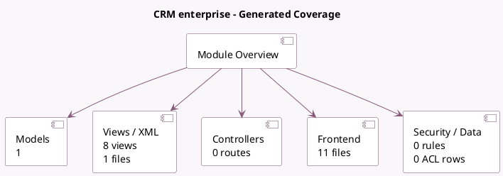

<!-- GENERATED:MODULE -->
---
tags: [odoo, enterprise, module]
---

# CRM enterprise

- Scope: Enterprise Addons
- Source: enterprise/crm_enterprise
- Dependencies: [[docs/Community Addons/crm/crm|crm]], [[docs/Enterprise Addons/web_cohort/web_cohort|web_cohort]], [[docs/Enterprise Addons/web_map/web_map|web_map]]

## Summary

Advanced features for CRM

## Generated coverage

- Models: 1
- XML files with UI/data artifacts: 1
- Views: 8
- Actions: 9
- Menus: 1
- Rules (ir.rule): 0
- Access CSV entries: 0
- Controller units: 0
- Frontend asset files: 11

## Module map

## Detail notes

- Models: [[docs/Enterprise Addons/crm_enterprise/Models|Models]] (1)
- Views and XML: [[docs/Enterprise Addons/crm_enterprise/Views|Views]] (1 files)
- Frontend: [[docs/Enterprise Addons/crm_enterprise/Frontend|Frontend]] (11 files)

## Key models

- `crm.lead`

## Navigation

- [[../Enterprise Addons/Enterprise Addons|Back to scope]]
- [[../../docs/docs|Back to docs]]

<!-- GENERATED:MODULE -->

