<!-- GENERATED:MODEL -->
---
tags: [odoo, enterprise, generated, model]
---

# helpdesk.ticket.to.lead

- Module: [[docs/Enterprise Addons/crm_helpdesk/crm_helpdesk|crm_helpdesk]]
- Scope: Enterprise Addons
- Defined in module: yes
- Source files: `wizard/helpdesk_ticket_to_lead.py`
- Python classes: `HelpdeskTicketToLead`
- Description: Convert Ticket to Lead

## Field footprint

- Detected fields: 7
- Field types: `Boolean` x 1, `Many2one` x 4, `Selection` x 2
- Relation fields: 4

## Sample fields

- `action`: `Selection` (compute `_compute_action`, store `True`)
- `convert_to`: `Selection`
- `force_assignment`: `Boolean` (comodel `Force assignment`)
- `partner_id`: `Many2one` (comodel `res.partner`, compute `_compute_partner_id`, store `True`)
- `team_id`: `Many2one` (comodel `crm.team`, compute `_compute_team_id`, store `True`)
- `ticket_id`: `Many2one` (comodel `helpdesk.ticket`)
- `user_id`: `Many2one` (comodel `res.users`, compute `_compute_user_id`, store `True`)

## Method hints

- Detected methods: 6
- Action methods: `action_convert_to_lead`
- Compute methods: `_compute_action`, `_compute_partner_id`, `_compute_team_id`, `_compute_user_id`
- Onchange methods: none

## Direct relation diagram

```plantuml
@startuml
!define ODOO_COLOR_PRIMARY #714B67
!define ODOO_COLOR_ACCENT #875A7B
!define ODOO_COLOR_BG #FAF7FA

skinparam backgroundColor ODOO_COLOR_BG
skinparam defaultTextAlignment left
skinparam ArrowColor ODOO_COLOR_ACCENT
skinparam ClassBackgroundColor white
skinparam ClassBorderColor ODOO_COLOR_PRIMARY
skinparam ComponentBackgroundColor white
skinparam ComponentBorderColor ODOO_COLOR_PRIMARY
skinparam NoteBackgroundColor #FFF8FF
skinparam NoteBorderColor ODOO_COLOR_ACCENT
skinparam SequenceLifeLineBorderColor ODOO_COLOR_ACCENT
skinparam SequenceLifeLineBackgroundColor #FFFFFF
skinparam SequenceParticipantBorderColor ODOO_COLOR_PRIMARY
skinparam SequenceParticipantBackgroundColor #FFFFFF
skinparam sequence {
  ArrowColor ODOO_COLOR_ACCENT
  ActorBorderColor ODOO_COLOR_PRIMARY
}
title helpdesk.ticket.to.lead - Direct Relations
class "helpdesk.ticket.to.lead" as helpdesk_ticket_to_lead
class "crm.team" as crm_team
class "helpdesk.ticket" as helpdesk_ticket
class "res.partner" as res_partner
class "res.users" as res_users
helpdesk_ticket_to_lead --> helpdesk_ticket : ticket_id
helpdesk_ticket_to_lead --> res_partner : partner_id
helpdesk_ticket_to_lead --> crm_team : team_id
helpdesk_ticket_to_lead --> res_users : user_id
@enduml
```

## Navigation

- **Parent:** [[docs/Enterprise Addons/crm_helpdesk/Models]]

<!-- GENERATED:MODEL -->
