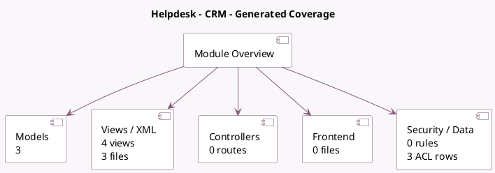

<!-- GENERATED:MODULE -->
---
tags: [odoo, enterprise, module]
---

# Helpdesk - CRM

- Scope: Enterprise Addons
- Source: enterprise/crm_helpdesk
- Dependencies: [[docs/Community Addons/crm/crm|crm]], [[docs/Enterprise Addons/helpdesk/helpdesk|helpdesk]]

## Summary

Convert Tickets from/to Leads

## Generated coverage

- Models: 3
- XML files with UI/data artifacts: 3
- Views: 4
- Actions: 1
- Menus: 0
- Rules (ir.rule): 0
- Access CSV entries: 3
- Controller units: 0
- Frontend asset files: 0

## Module map

## Detail notes

- Models: [[docs/Enterprise Addons/crm_helpdesk/Models|Models]] (3)
- Views and XML: [[docs/Enterprise Addons/crm_helpdesk/Views|Views]] (3 files)

## Key models

- `crm.lead.convert2ticket`
- `helpdesk.ticket`
- `helpdesk.ticket.to.lead`

## Navigation

- [[../Enterprise Addons/Enterprise Addons|Back to scope]]
- [[../../docs/docs|Back to docs]]

<!-- GENERATED:MODULE -->

