<!-- GENERATED:MODEL -->
---
tags: [odoo, enterprise, generated, model]
---

# data_cleaning.model

- Module: [[docs/Enterprise Addons/data_cleaning/data_cleaning|data_cleaning]]
- Scope: Enterprise Addons
- Defined in module: yes
- Source files: `models/data_cleaning_model.py`
- Python classes: `Data_CleaningModel`
- Description: Cleaning Model

## Field footprint

- Detected fields: 11
- Field types: `Boolean` x 1, `Char` x 2, `Datetime` x 1, `Integer` x 2, `Many2many` x 1, `Many2one` x 1, `One2many` x 1, `Selection` x 2
- Relation fields: 3

## Sample fields

- `active`: `Boolean`
- `cleaning_mode`: `Selection`
- `last_notification`: `Datetime`
- `name`: `Char` (compute `_compute_name`, store `True`)
- `notify_frequency`: `Integer`
- `notify_frequency_period`: `Selection`
- `notify_user_ids`: `Many2many` (comodel `res.users`)
- `records_to_clean_count`: `Integer` (comodel `Records To Clean`, compute `_compute_records_to_clean`)
- `res_model_id`: `Many2one` (comodel `ir.model`)
- `res_model_name`: `Char` (related `res_model_id.model`, store `True`)
- `rule_ids`: `One2many` (comodel `data_cleaning.rule`)

## Method hints

- Detected methods: 11
- Action methods: `action_clean_records`
- Compute methods: `_compute_name`, `_compute_records_to_clean`
- Onchange methods: `_compute_name`, `_onchange_res_model_id`

## Direct relation diagram

```plantuml
@startuml
!define ODOO_COLOR_PRIMARY #714B67
!define ODOO_COLOR_ACCENT #875A7B
!define ODOO_COLOR_BG #FAF7FA

skinparam backgroundColor ODOO_COLOR_BG
skinparam defaultTextAlignment left
skinparam ArrowColor ODOO_COLOR_ACCENT
skinparam ClassBackgroundColor white
skinparam ClassBorderColor ODOO_COLOR_PRIMARY
skinparam ComponentBackgroundColor white
skinparam ComponentBorderColor ODOO_COLOR_PRIMARY
skinparam NoteBackgroundColor #FFF8FF
skinparam NoteBorderColor ODOO_COLOR_ACCENT
skinparam SequenceLifeLineBorderColor ODOO_COLOR_ACCENT
skinparam SequenceLifeLineBackgroundColor #FFFFFF
skinparam SequenceParticipantBorderColor ODOO_COLOR_PRIMARY
skinparam SequenceParticipantBackgroundColor #FFFFFF
skinparam sequence {
  ArrowColor ODOO_COLOR_ACCENT
  ActorBorderColor ODOO_COLOR_PRIMARY
}
title data_cleaning.model - Direct Relations
class "data_cleaning.model" as data_cleaning_model
class "data_cleaning.rule" as data_cleaning_rule
class "ir.model" as ir_model
class "res.users" as res_users
data_cleaning_model --> ir_model : res_model_id
data_cleaning_model --|> data_cleaning_rule : rule_ids
data_cleaning_model .. res_users : notify_user_ids
@enduml
```

## Navigation

- **Parent:** [[docs/Enterprise Addons/data_cleaning/Models]]

<!-- GENERATED:MODEL -->
