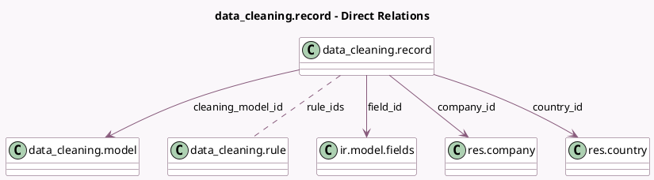

<!-- GENERATED:MODEL -->
---
tags: [odoo, enterprise, generated, model]
---

# data_cleaning.record

- Module: [[docs/Enterprise Addons/data_cleaning/data_cleaning|data_cleaning]]
- Scope: Enterprise Addons
- Defined in module: yes
- Source files: `models/data_cleaning_record.py`
- Python classes: `Data_CleaningRecord`
- Description: Cleaning Record

## Field footprint

- Detected fields: 15
- Field types: `Boolean` x 1, `Char` x 7, `Integer` x 1, `Many2many` x 1, `Many2one` x 5
- Relation fields: 6

## Sample fields

- `action`: `Char` (comodel `Actions`, compute `_compute_non_stored_values`)
- `active`: `Boolean` (comodel `Active`)
- `cleaning_model_id`: `Many2one` (comodel `data_cleaning.model`)
- `company_id`: `Many2one` (comodel `res.company`, compute `_compute_stored_values`, store `True`)
- `country_id`: `Many2one` (comodel `res.country`, compute `_compute_stored_values`, store `True`)
- `current_value`: `Char` (comodel `Current`, compute `_compute_non_stored_values`)
- `field_id`: `Many2one` (comodel `ir.model.fields`)
- `field_name`: `Char` (related `field_id.name`)
- `name`: `Char` (comodel `Record Name`, compute `_compute_non_stored_values`)
- `res_id`: `Integer` (comodel `Record ID`)
- `res_model_id`: `Many2one` (related `cleaning_model_id.res_model_id`, store `True`)
- `res_model_name`: `Char` (related `cleaning_model_id.res_model_name`, store `True`)
- `rule_ids`: `Many2many` (comodel `data_cleaning.rule`)
- `suggested_value`: `Char` (comodel `Suggested Value`, compute `_compute_non_stored_values`)
- `suggested_value_display`: `Char` (comodel `Suggested`, compute `_compute_non_stored_values`)

## Method hints

- Detected methods: 8
- Action methods: `action_discard`, `action_validate`
- Compute methods: `_compute_non_stored_values`, `_compute_stored_values`
- Onchange methods: none

## Direct relation diagram

## Navigation

- **Parent:** [[docs/Enterprise Addons/data_cleaning/Models]]

<!-- GENERATED:MODEL -->
