<!-- GENERATED:MODEL -->
---
tags: [odoo, enterprise, generated, model]
---

# data_cleaning.rule

- Module: [[docs/Enterprise Addons/data_cleaning/data_cleaning|data_cleaning]]
- Scope: Enterprise Addons
- Defined in module: yes
- Source files: `models/data_cleaning_rule.py`
- Python classes: `Data_CleaningRule`
- Description: Cleaning Rule

## Field footprint

- Detected fields: 11
- Field types: `Char` x 4, `Integer` x 1, `Many2one` x 3, `Selection` x 3
- Relation fields: 3

## Sample fields

- `action`: `Selection`
- `action_case`: `Selection`
- `action_display`: `Char` (compute `_compute_action`)
- `action_technical`: `Char` (compute `_compute_action`)
- `action_trim`: `Selection`
- `cleaning_model_id`: `Many2one` (comodel `data_cleaning.model`)
- `field_id`: `Many2one` (comodel `ir.model.fields`)
- `name`: `Char` (related `field_id.name`)
- `res_model_id`: `Many2one` (related `cleaning_model_id.res_model_id`, store `True`)
- `res_model_name`: `Char` (related `cleaning_model_id.res_model_name`, store `True`)
- `sequence`: `Integer`

## Method hints

- Detected methods: 4
- Action methods: none
- Compute methods: `_compute_action`
- Onchange methods: `_onchange_action`

## Direct relation diagram

```plantuml
@startuml
!define ODOO_COLOR_PRIMARY #714B67
!define ODOO_COLOR_ACCENT #875A7B
!define ODOO_COLOR_BG #FAF7FA

skinparam backgroundColor ODOO_COLOR_BG
skinparam defaultTextAlignment left
skinparam ArrowColor ODOO_COLOR_ACCENT
skinparam ClassBackgroundColor white
skinparam ClassBorderColor ODOO_COLOR_PRIMARY
skinparam ComponentBackgroundColor white
skinparam ComponentBorderColor ODOO_COLOR_PRIMARY
skinparam NoteBackgroundColor #FFF8FF
skinparam NoteBorderColor ODOO_COLOR_ACCENT
skinparam SequenceLifeLineBorderColor ODOO_COLOR_ACCENT
skinparam SequenceLifeLineBackgroundColor #FFFFFF
skinparam SequenceParticipantBorderColor ODOO_COLOR_PRIMARY
skinparam SequenceParticipantBackgroundColor #FFFFFF
skinparam sequence {
  ArrowColor ODOO_COLOR_ACCENT
  ActorBorderColor ODOO_COLOR_PRIMARY
}
title data_cleaning.rule - Direct Relations
class "data_cleaning.rule" as data_cleaning_rule
class "data_cleaning.model" as data_cleaning_model
class "ir.model.fields" as ir_model_fields
data_cleaning_rule --> data_cleaning_model : cleaning_model_id
data_cleaning_rule --> ir_model_fields : field_id
@enduml
```

## Navigation

- **Parent:** [[docs/Enterprise Addons/data_cleaning/Models]]

<!-- GENERATED:MODEL -->
