<!-- GENERATED:MODEL -->
---
tags: [odoo, enterprise, generated, model]
---

# data_merge.group

- Module: [[docs/Enterprise Addons/data_cleaning/data_cleaning|data_cleaning]]
- Scope: Enterprise Addons
- Defined in module: yes
- Source files: `models/data_merge_group.py`
- Python classes: `Data_MergeGroup`
- Description: Deduplication Group

## Field footprint

- Detected fields: 7
- Field types: `Boolean` x 1, `Char` x 2, `Float` x 1, `Many2one` x 2, `One2many` x 1
- Relation fields: 3

## Sample fields

- `active`: `Boolean`
- `divergent_fields`: `Char` (compute `_compute_similarity`, store `True`)
- `model_id`: `Many2one` (comodel `data_merge.model`)
- `record_ids`: `One2many` (comodel `data_merge.record`)
- `res_model_id`: `Many2one` (related `model_id.res_model_id`, store `True`)
- `res_model_name`: `Char` (related `model_id.res_model_name`, store `True`)
- `similarity`: `Float` (compute `_compute_similarity`, store `True`)

## Method hints

- Detected methods: 13
- Action methods: none
- Compute methods: `_compute_display_name`, `_compute_similarity`
- Onchange methods: none

## Direct relation diagram

```plantuml
@startuml
!define ODOO_COLOR_PRIMARY #714B67
!define ODOO_COLOR_ACCENT #875A7B
!define ODOO_COLOR_BG #FAF7FA

skinparam backgroundColor ODOO_COLOR_BG
skinparam defaultTextAlignment left
skinparam ArrowColor ODOO_COLOR_ACCENT
skinparam ClassBackgroundColor white
skinparam ClassBorderColor ODOO_COLOR_PRIMARY
skinparam ComponentBackgroundColor white
skinparam ComponentBorderColor ODOO_COLOR_PRIMARY
skinparam NoteBackgroundColor #FFF8FF
skinparam NoteBorderColor ODOO_COLOR_ACCENT
skinparam SequenceLifeLineBorderColor ODOO_COLOR_ACCENT
skinparam SequenceLifeLineBackgroundColor #FFFFFF
skinparam SequenceParticipantBorderColor ODOO_COLOR_PRIMARY
skinparam SequenceParticipantBackgroundColor #FFFFFF
skinparam sequence {
  ArrowColor ODOO_COLOR_ACCENT
  ActorBorderColor ODOO_COLOR_PRIMARY
}
title data_merge.group - Direct Relations
class "data_merge.group" as data_merge_group
class "data_merge.model" as data_merge_model
class "data_merge.record" as data_merge_record
data_merge_group --> data_merge_model : model_id
data_merge_group --|> data_merge_record : record_ids
@enduml
```

## Navigation

- **Parent:** [[docs/Enterprise Addons/data_cleaning/Models]]

<!-- GENERATED:MODEL -->
