<!-- GENERATED:MODEL -->
---
tags: [odoo, enterprise, generated, model]
---

# data_merge.record

- Module: [[docs/Enterprise Addons/data_cleaning/data_cleaning|data_cleaning]]
- Scope: Enterprise Addons
- Defined in module: yes
- Source files: `models/data_merge_record.py`
- Python classes: `Data_MergeRecord`
- Description: Deduplication Record

## Field footprint

- Detected fields: 18
- Field types: `Boolean` x 4, `Char` x 7, `Datetime` x 2, `Integer` x 1, `Many2one` x 4
- Relation fields: 4

## Sample fields

- `active`: `Boolean` (compute `_compute_active`, store `True`)
- `company_id`: `Many2one` (comodel `res.company`, compute `_compute_fields`)
- `differences`: `Char` (compute `_compute_differences`, store `True`)
- `field_values`: `Char` (compute `_compute_field_values`)
- `group_id`: `Many2one` (comodel `data_merge.group`)
- `is_deleted`: `Boolean` (compute `_compute_fields`)
- `is_discarded`: `Boolean`
- `is_master`: `Boolean`
- `model_id`: `Many2one` (related `group_id.model_id`, store `True`)
- `name`: `Char` (compute `_compute_fields`)
- `record_create_date`: `Datetime` (compute `_compute_fields`)
- `record_create_uid`: `Char` (compute `_compute_fields`)
- `record_write_date`: `Datetime` (compute `_compute_fields`)
- `record_write_uid`: `Char` (compute `_compute_fields`)
- `res_id`: `Integer`
- `res_model_id`: `Many2one` (related `group_id.res_model_id`, store `True`)
- `res_model_name`: `Char` (related `group_id.res_model_name`, store `True`)
- `used_in`: `Char` (compute `_compute_usage`, store `True`)

## Method hints

- Detected methods: 18
- Action methods: `action_deduplicates`
- Compute methods: `_compute_active`, `_compute_differences`, `_compute_field_values`, `_compute_fields`, `_compute_usage`
- Onchange methods: none

## Direct relation diagram

```plantuml
@startuml
!define ODOO_COLOR_PRIMARY #714B67
!define ODOO_COLOR_ACCENT #875A7B
!define ODOO_COLOR_BG #FAF7FA

skinparam backgroundColor ODOO_COLOR_BG
skinparam defaultTextAlignment left
skinparam ArrowColor ODOO_COLOR_ACCENT
skinparam ClassBackgroundColor white
skinparam ClassBorderColor ODOO_COLOR_PRIMARY
skinparam ComponentBackgroundColor white
skinparam ComponentBorderColor ODOO_COLOR_PRIMARY
skinparam NoteBackgroundColor #FFF8FF
skinparam NoteBorderColor ODOO_COLOR_ACCENT
skinparam SequenceLifeLineBorderColor ODOO_COLOR_ACCENT
skinparam SequenceLifeLineBackgroundColor #FFFFFF
skinparam SequenceParticipantBorderColor ODOO_COLOR_PRIMARY
skinparam SequenceParticipantBackgroundColor #FFFFFF
skinparam sequence {
  ArrowColor ODOO_COLOR_ACCENT
  ActorBorderColor ODOO_COLOR_PRIMARY
}
title data_merge.record - Direct Relations
class "data_merge.record" as data_merge_record
class "data_merge.group" as data_merge_group
class "res.company" as res_company
data_merge_record --> data_merge_group : group_id
data_merge_record --> res_company : company_id
@enduml
```

## Navigation

- **Parent:** [[docs/Enterprise Addons/data_cleaning/Models]]

<!-- GENERATED:MODEL -->
