<!-- GENERATED:MODEL -->
---
tags: [odoo, enterprise, generated, model]
---

# ir.model

- Module: [[docs/Enterprise Addons/data_cleaning/data_cleaning|data_cleaning]]
- Scope: Enterprise Addons
- Defined in module: extension only
- Source files: `models/ir_model.py`
- Python classes: `IrModel`

## Field footprint

- Detected fields: 3
- Field types: `Boolean` x 2, `Many2one` x 1
- Relation fields: 1

## Sample fields

- `hide_merge_action`: `Boolean` (compute `_compute_hide_merge_action`)
- `is_merge_enabled`: `Boolean` (compute `_compute_is_merge_enabled`)
- `ref_merge_ir_act_server_id`: `Many2one` (comodel `ir.actions.server`)

## Method hints

- Detected methods: 5
- Action methods: `action_merge`, `action_merge_contextual_disable`, `action_merge_contextual_enable`
- Compute methods: `_compute_hide_merge_action`, `_compute_is_merge_enabled`
- Onchange methods: none

## Direct relation diagram

```plantuml
@startuml
!define ODOO_COLOR_PRIMARY #714B67
!define ODOO_COLOR_ACCENT #875A7B
!define ODOO_COLOR_BG #FAF7FA

skinparam backgroundColor ODOO_COLOR_BG
skinparam defaultTextAlignment left
skinparam ArrowColor ODOO_COLOR_ACCENT
skinparam ClassBackgroundColor white
skinparam ClassBorderColor ODOO_COLOR_PRIMARY
skinparam ComponentBackgroundColor white
skinparam ComponentBorderColor ODOO_COLOR_PRIMARY
skinparam NoteBackgroundColor #FFF8FF
skinparam NoteBorderColor ODOO_COLOR_ACCENT
skinparam SequenceLifeLineBorderColor ODOO_COLOR_ACCENT
skinparam SequenceLifeLineBackgroundColor #FFFFFF
skinparam SequenceParticipantBorderColor ODOO_COLOR_PRIMARY
skinparam SequenceParticipantBackgroundColor #FFFFFF
skinparam sequence {
  ArrowColor ODOO_COLOR_ACCENT
  ActorBorderColor ODOO_COLOR_PRIMARY
}
title ir.model - Direct Relations
class "ir.model" as ir_model
class "ir.actions.server" as ir_actions_server
ir_model --> ir_actions_server : ref_merge_ir_act_server_id
@enduml
```

## Navigation

- **Parent:** [[docs/Enterprise Addons/data_cleaning/Models]]

<!-- GENERATED:MODEL -->
