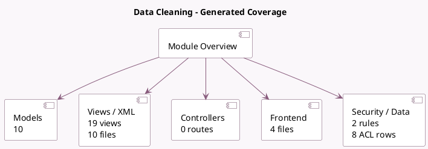

<!-- GENERATED:MODULE -->
---
tags: [odoo, enterprise, module]
---

# Data Cleaning

- Scope: Enterprise Addons
- Source: enterprise/data_cleaning
- Dependencies: [[docs/Community Addons/data_recycle/data_recycle|data_recycle]], [[docs/Community Addons/phone_validation/phone_validation|phone_validation]], [[docs/Community Addons/mail/mail|mail]]

## Summary

Easily format text data across multiple records. Find duplicate records and easily merge them.

## Generated coverage

- Models: 10
- XML files with UI/data artifacts: 10
- Views: 19
- Actions: 8
- Menus: 6
- Rules (ir.rule): 2
- Access CSV entries: 8
- Controller units: 0
- Frontend asset files: 4

## Module map

## Detail notes

- Models: [[docs/Enterprise Addons/data_cleaning/Models|Models]] (10)
- Views and XML: [[docs/Enterprise Addons/data_cleaning/Views|Views]] (10 files)
- Frontend: [[docs/Enterprise Addons/data_cleaning/Frontend|Frontend]] (4 files)

## Key models

- `data_cleaning.model`
- `data_cleaning.record`
- `data_cleaning.rule`
- `data_merge.group`
- `data_merge.model`
- `data_merge.record`
- `data_merge.rule`
- `ir.attachment.report`
- `ir.model`
- `res.partner`

## Navigation

- [[../Enterprise Addons/Enterprise Addons|Back to scope]]
- [[../../docs/docs|Back to docs]]

<!-- GENERATED:MODULE -->

