<!-- GENERATED:MODEL -->
---
tags: [odoo, enterprise, generated, model]
---

# databases.manage_users.wizard

- Module: [[docs/Enterprise Addons/databases/databases|databases]]
- Scope: Enterprise Addons
- Defined in module: yes
- Source files: `wizard/databases_manage_users_wizard.py`
- Python classes: `DatabasesInviteUsersWizard`
- Description: Database Users Invitation Wizard

## Field footprint

- Detected fields: 8
- Field types: `Char` x 2, `Many2many` x 4, `Selection` x 2
- Relation fields: 4

## Sample fields

- `database_ids`: `Many2many` (comodel `project.project`)
- `error_message`: `Char`
- `everywhere_user_ids`: `Many2many` (comodel `res.users`, compute `_compute_everywhere_user_ids`)
- `mode`: `Selection`
- `removable_user_ids`: `Many2many` (comodel `res.users`, compute `_compute_removable_user_ids`)
- `state`: `Selection`
- `summary_message`: `Char` (compute `_compute_summary_message`)
- `user_ids`: `Many2many` (comodel `res.users`)

## Method hints

- Detected methods: 6
- Action methods: `action_invite_users`, `action_remove_users`
- Compute methods: `_compute_everywhere_user_ids`, `_compute_removable_user_ids`, `_compute_summary_message`
- Onchange methods: none

## Direct relation diagram

```plantuml
@startuml
!define ODOO_COLOR_PRIMARY #714B67
!define ODOO_COLOR_ACCENT #875A7B
!define ODOO_COLOR_BG #FAF7FA

skinparam backgroundColor ODOO_COLOR_BG
skinparam defaultTextAlignment left
skinparam ArrowColor ODOO_COLOR_ACCENT
skinparam ClassBackgroundColor white
skinparam ClassBorderColor ODOO_COLOR_PRIMARY
skinparam ComponentBackgroundColor white
skinparam ComponentBorderColor ODOO_COLOR_PRIMARY
skinparam NoteBackgroundColor #FFF8FF
skinparam NoteBorderColor ODOO_COLOR_ACCENT
skinparam SequenceLifeLineBorderColor ODOO_COLOR_ACCENT
skinparam SequenceLifeLineBackgroundColor #FFFFFF
skinparam SequenceParticipantBorderColor ODOO_COLOR_PRIMARY
skinparam SequenceParticipantBackgroundColor #FFFFFF
skinparam sequence {
  ArrowColor ODOO_COLOR_ACCENT
  ActorBorderColor ODOO_COLOR_PRIMARY
}
title databases.manage_users.wizard - Direct Relations
class "databases.manage_users.wizard" as databases_manage_users_wizard
class "project.project" as project_project
class "res.users" as res_users
databases_manage_users_wizard .. project_project : database_ids
databases_manage_users_wizard .. res_users : user_ids
databases_manage_users_wizard .. res_users : everywhere_user_ids
databases_manage_users_wizard .. res_users : removable_user_ids
@enduml
```

## Navigation

- **Parent:** [[docs/Enterprise Addons/databases/Models]]

<!-- GENERATED:MODEL -->
