<!-- GENERATED:MODEL -->
---
tags: [odoo, enterprise, generated, model]
---

# databases.user

- Module: [[docs/Enterprise Addons/databases/databases|databases]]
- Scope: Enterprise Addons
- Defined in module: yes
- Source files: `models/databases_user.py`
- Python classes: `DatabasesUser`
- Description: Database User

## Field footprint

- Detected fields: 5
- Field types: `Char` x 2, `Datetime` x 1, `Many2one` x 2
- Relation fields: 2

## Sample fields

- `latest_authentication`: `Datetime`
- `local_user_id`: `Many2one` (comodel `res.users`, compute `_compute_local_user_id`)
- `login`: `Char`
- `name`: `Char`
- `project_id`: `Many2one` (comodel `project.project`)

## Method hints

- Detected methods: 3
- Action methods: `action_invite_users`, `action_remove_users`
- Compute methods: `_compute_local_user_id`
- Onchange methods: none

## Direct relation diagram

```plantuml
@startuml
!define ODOO_COLOR_PRIMARY #714B67
!define ODOO_COLOR_ACCENT #875A7B
!define ODOO_COLOR_BG #FAF7FA

skinparam backgroundColor ODOO_COLOR_BG
skinparam defaultTextAlignment left
skinparam ArrowColor ODOO_COLOR_ACCENT
skinparam ClassBackgroundColor white
skinparam ClassBorderColor ODOO_COLOR_PRIMARY
skinparam ComponentBackgroundColor white
skinparam ComponentBorderColor ODOO_COLOR_PRIMARY
skinparam NoteBackgroundColor #FFF8FF
skinparam NoteBorderColor ODOO_COLOR_ACCENT
skinparam SequenceLifeLineBorderColor ODOO_COLOR_ACCENT
skinparam SequenceLifeLineBackgroundColor #FFFFFF
skinparam SequenceParticipantBorderColor ODOO_COLOR_PRIMARY
skinparam SequenceParticipantBackgroundColor #FFFFFF
skinparam sequence {
  ArrowColor ODOO_COLOR_ACCENT
  ActorBorderColor ODOO_COLOR_PRIMARY
}
title databases.user - Direct Relations
class "databases.user" as databases_user
class "project.project" as project_project
class "res.users" as res_users
databases_user --> project_project : project_id
databases_user --> res_users : local_user_id
@enduml
```

## Navigation

- **Parent:** [[docs/Enterprise Addons/databases/Models]]

<!-- GENERATED:MODEL -->
