<!-- GENERATED:MODEL -->
---
tags: [odoo, enterprise, generated, model]
---

# project.project

- Module: [[docs/Enterprise Addons/databases/databases|databases]]
- Scope: Enterprise Addons
- Defined in module: extension only
- Source files: `models/project_project.py`
- Python classes: `ProjectProject`

## Field footprint

- Detected fields: 18
- Field types: `Boolean` x 4, `Char` x 6, `Datetime` x 1, `Integer` x 3, `Many2one` x 1, `One2many` x 1, `Properties` x 1, `Selection` x 1
- Relation fields: 2

## Sample fields

- `database_api_key`: `Char`
- `database_api_key_to_use`: `Char` (compute `_compute_database_api_key_to_use`)
- `database_api_login`: `Char`
- `database_can_access`: `Boolean` (compute `_compute_database_can_access`)
- `database_fetch_documents`: `Boolean` (comodel `Fetch Documents`)
- `database_fetch_draft_entries`: `Boolean` (comodel `Fetch Draft Journal Entries`)
- `database_fetch_tax_returns`: `Boolean` (comodel `Fetch Tax Returns`)
- `database_hosting`: `Selection`
- `database_kpi_base_definition_id`: `Many2one` (comodel `properties.base.definition`, compute `_compute_database_kpi_base_definition_id`)
- `database_kpi_properties`: `Properties` (comodel `Metrics`)
- `database_last_synchro`: `Datetime` (comodel `Last Synchronization`)
- `database_name`: `Char`
- `database_nb_documents`: `Integer` (comodel `Amount of documents in Inbox`)
- `database_nb_synchro_errors`: `Integer` (comodel `Synchronization Errors Count`)
- `database_nb_users`: `Integer` (comodel `Amount of Users`, compute `_compute_database_nb_users`, store `True`)
- `database_url`: `Char`
- `database_user_ids`: `One2many` (comodel `databases.user`)
- `database_version`: `Char`

## Method hints

- Detected methods: 17
- Action methods: `action_database_connect`, `action_database_invite_users`, `action_database_remove_users`, `action_database_synchronize`, `action_open_self`, `action_synchronize_all_databases`
- Compute methods: `_compute_database_api_key_to_use`, `_compute_database_can_access`, `_compute_database_kpi_base_definition_id`, `_compute_database_nb_users`
- Onchange methods: none

## Direct relation diagram

```plantuml
@startuml
!define ODOO_COLOR_PRIMARY #714B67
!define ODOO_COLOR_ACCENT #875A7B
!define ODOO_COLOR_BG #FAF7FA

skinparam backgroundColor ODOO_COLOR_BG
skinparam defaultTextAlignment left
skinparam ArrowColor ODOO_COLOR_ACCENT
skinparam ClassBackgroundColor white
skinparam ClassBorderColor ODOO_COLOR_PRIMARY
skinparam ComponentBackgroundColor white
skinparam ComponentBorderColor ODOO_COLOR_PRIMARY
skinparam NoteBackgroundColor #FFF8FF
skinparam NoteBorderColor ODOO_COLOR_ACCENT
skinparam SequenceLifeLineBorderColor ODOO_COLOR_ACCENT
skinparam SequenceLifeLineBackgroundColor #FFFFFF
skinparam SequenceParticipantBorderColor ODOO_COLOR_PRIMARY
skinparam SequenceParticipantBackgroundColor #FFFFFF
skinparam sequence {
  ArrowColor ODOO_COLOR_ACCENT
  ActorBorderColor ODOO_COLOR_PRIMARY
}
title project.project - Direct Relations
class "project.project" as project_project
class "databases.user" as databases_user
class "properties.base.definition" as properties_base_definition
project_project --> properties_base_definition : database_kpi_base_definition_id
project_project --|> databases_user : database_user_ids
@enduml
```

## Navigation

- **Parent:** [[docs/Enterprise Addons/databases/Models]]

<!-- GENERATED:MODEL -->
