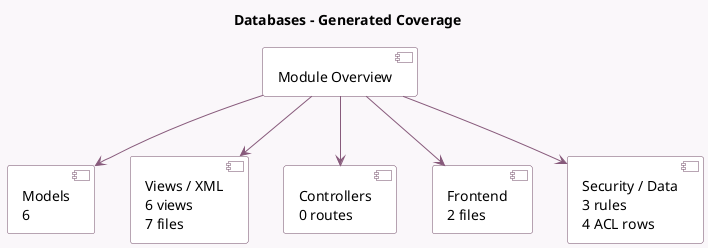

<!-- GENERATED:MODULE -->
---
tags: [odoo, enterprise, module]
---

# Databases

- Scope: Enterprise Addons
- Source: enterprise/databases
- Dependencies: [[docs/Community Addons/project/project|project]]

## Summary

Manage a fleet of Odoo databases

## Generated coverage

- Models: 6
- XML files with UI/data artifacts: 7
- Views: 6
- Actions: 7
- Menus: 5
- Rules (ir.rule): 3
- Access CSV entries: 4
- Controller units: 0
- Frontend asset files: 2

## Module map

## Detail notes

- Models: [[docs/Enterprise Addons/databases/Models|Models]] (6)
- Views and XML: [[docs/Enterprise Addons/databases/Views|Views]] (7 files)
- Frontend: [[docs/Enterprise Addons/databases/Frontend|Frontend]] (2 files)

## Key models

- `databases.manage_users.wizard`
- `databases.synchronization.wizard`
- `databases.user`
- `project.project`
- `project.template.create.wizard`
- `res.config.settings`

## Navigation

- [[../Enterprise Addons/Enterprise Addons|Back to scope]]
- [[../../docs/docs|Back to docs]]

<!-- GENERATED:MODULE -->

