<!-- GENERATED:MODEL -->
---
tags: [odoo, enterprise, generated, model]
---

# delivery.carrier

- Module: [[docs/Enterprise Addons/delivery_bpost/delivery_bpost|delivery_bpost]]
- Scope: Enterprise Addons
- Defined in module: extension only
- Source files: `models/delivery_bpost.py`
- Python classes: `DeliveryCarrier`

## Field footprint

- Detected fields: 12
- Field types: `Boolean` x 1, `Char` x 2, `Many2one` x 1, `Selection` x 8
- Relation fields: 1

## Sample fields

- `bpost_account_number`: `Char`
- `bpost_default_package_type_id`: `Many2one` (comodel `stock.package.type`)
- `bpost_delivery_nature`: `Selection`
- `bpost_developer_password`: `Char`
- `bpost_domestic_deliver_type`: `Selection`
- `bpost_international_deliver_type`: `Selection`
- `bpost_label_format`: `Selection`
- `bpost_label_stock_type`: `Selection`
- `bpost_parcel_return_instructions`: `Selection`
- `bpost_saturday`: `Boolean`
- `bpost_shipment_type`: `Selection`
- `delivery_type`: `Selection`

## Method hints

- Detected methods: 10
- Action methods: none
- Compute methods: `_compute_can_generate_return`
- Onchange methods: none

## Direct relation diagram

```plantuml
@startuml
!define ODOO_COLOR_PRIMARY #714B67
!define ODOO_COLOR_ACCENT #875A7B
!define ODOO_COLOR_BG #FAF7FA

skinparam backgroundColor ODOO_COLOR_BG
skinparam defaultTextAlignment left
skinparam ArrowColor ODOO_COLOR_ACCENT
skinparam ClassBackgroundColor white
skinparam ClassBorderColor ODOO_COLOR_PRIMARY
skinparam ComponentBackgroundColor white
skinparam ComponentBorderColor ODOO_COLOR_PRIMARY
skinparam NoteBackgroundColor #FFF8FF
skinparam NoteBorderColor ODOO_COLOR_ACCENT
skinparam SequenceLifeLineBorderColor ODOO_COLOR_ACCENT
skinparam SequenceLifeLineBackgroundColor #FFFFFF
skinparam SequenceParticipantBorderColor ODOO_COLOR_PRIMARY
skinparam SequenceParticipantBackgroundColor #FFFFFF
skinparam sequence {
  ArrowColor ODOO_COLOR_ACCENT
  ActorBorderColor ODOO_COLOR_PRIMARY
}
title delivery.carrier - Direct Relations
class "delivery.carrier" as delivery_carrier
class "stock.package.type" as stock_package_type
delivery_carrier --> stock_package_type : bpost_default_package_type_id
@enduml
```

## Navigation

- **Parent:** [[docs/Enterprise Addons/delivery_bpost/Models]]

<!-- GENERATED:MODEL -->
