<!-- GENERATED:MODEL -->
---
tags: [odoo, enterprise, generated, model]
---

# delivery.carrier.easypost

- Module: [[docs/Enterprise Addons/delivery_easypost/delivery_easypost|delivery_easypost]]
- Scope: Enterprise Addons
- Defined in module: yes
- Source files: `wizard/carrier_type.py`
- Python classes: `DeliveryCarrierEasypost`
- Description: Carrier Type

## Field footprint

- Detected fields: 2
- Field types: `Char` x 1, `Many2one` x 1
- Relation fields: 1

## Sample fields

- `carrier_type`: `Char`
- `delivery_carrier_id`: `Many2one` (comodel `delivery.carrier`)

## Method hints

- Detected methods: 1
- Action methods: `action_validate`
- Compute methods: none
- Onchange methods: none

## Direct relation diagram

```plantuml
@startuml
!define ODOO_COLOR_PRIMARY #714B67
!define ODOO_COLOR_ACCENT #875A7B
!define ODOO_COLOR_BG #FAF7FA

skinparam backgroundColor ODOO_COLOR_BG
skinparam defaultTextAlignment left
skinparam ArrowColor ODOO_COLOR_ACCENT
skinparam ClassBackgroundColor white
skinparam ClassBorderColor ODOO_COLOR_PRIMARY
skinparam ComponentBackgroundColor white
skinparam ComponentBorderColor ODOO_COLOR_PRIMARY
skinparam NoteBackgroundColor #FFF8FF
skinparam NoteBorderColor ODOO_COLOR_ACCENT
skinparam SequenceLifeLineBorderColor ODOO_COLOR_ACCENT
skinparam SequenceLifeLineBackgroundColor #FFFFFF
skinparam SequenceParticipantBorderColor ODOO_COLOR_PRIMARY
skinparam SequenceParticipantBackgroundColor #FFFFFF
skinparam sequence {
  ArrowColor ODOO_COLOR_ACCENT
  ActorBorderColor ODOO_COLOR_PRIMARY
}
title delivery.carrier.easypost - Direct Relations
class "delivery.carrier.easypost" as delivery_carrier_easypost
class "delivery.carrier" as delivery_carrier
delivery_carrier_easypost --> delivery_carrier : delivery_carrier_id
@enduml
```

## Navigation

- **Parent:** [[docs/Enterprise Addons/delivery_easypost/Models]]

<!-- GENERATED:MODEL -->
