<!-- GENERATED:MODEL -->
---
tags: [odoo, enterprise, generated, model]
---

# delivery.carrier

- Module: [[docs/Enterprise Addons/delivery_easypost/delivery_easypost|delivery_easypost]]
- Scope: Enterprise Addons
- Defined in module: extension only
- Source files: `models/delivery_carrier.py`
- Python classes: `DeliveryCarrier`

## Field footprint

- Detected fields: 10
- Field types: `Char` x 4, `Float` x 2, `Many2one` x 2, `Selection` x 2
- Relation fields: 2

## Sample fields

- `delivery_type`: `Selection`
- `easypost_default_package_type_id`: `Many2one` (comodel `stock.package.type`)
- `easypost_default_service_id`: `Many2one` (comodel `easypost.service`)
- `easypost_delivery_type`: `Char` (comodel `Easypost Carrier Type`)
- `easypost_delivery_type_id`: `Char` (comodel `Easypost Carrier Type ID, technical for API request`)
- `easypost_insurance_fee_minimum`: `Float` (comodel `Insurance fee minimum (USD)`)
- `easypost_insurance_fee_rate`: `Float` (comodel `Insurance fee rate (USD)`)
- `easypost_label_file_type`: `Selection`
- `easypost_production_api_key`: `Char` (comodel `Production API Key`)
- `easypost_test_api_key`: `Char` (comodel `Test API Key`)

## Method hints

- Detected methods: 16
- Action methods: `action_get_carrier_type`
- Compute methods: `_compute_can_generate_return`, `_compute_supports_shipping_insurance`
- Onchange methods: `_onchange_delivery_type`

## Direct relation diagram

```plantuml
@startuml
!define ODOO_COLOR_PRIMARY #714B67
!define ODOO_COLOR_ACCENT #875A7B
!define ODOO_COLOR_BG #FAF7FA

skinparam backgroundColor ODOO_COLOR_BG
skinparam defaultTextAlignment left
skinparam ArrowColor ODOO_COLOR_ACCENT
skinparam ClassBackgroundColor white
skinparam ClassBorderColor ODOO_COLOR_PRIMARY
skinparam ComponentBackgroundColor white
skinparam ComponentBorderColor ODOO_COLOR_PRIMARY
skinparam NoteBackgroundColor #FFF8FF
skinparam NoteBorderColor ODOO_COLOR_ACCENT
skinparam SequenceLifeLineBorderColor ODOO_COLOR_ACCENT
skinparam SequenceLifeLineBackgroundColor #FFFFFF
skinparam SequenceParticipantBorderColor ODOO_COLOR_PRIMARY
skinparam SequenceParticipantBackgroundColor #FFFFFF
skinparam sequence {
  ArrowColor ODOO_COLOR_ACCENT
  ActorBorderColor ODOO_COLOR_PRIMARY
}
title delivery.carrier - Direct Relations
class "delivery.carrier" as delivery_carrier
class "easypost.service" as easypost_service
class "stock.package.type" as stock_package_type
delivery_carrier --> stock_package_type : easypost_default_package_type_id
delivery_carrier --> easypost_service : easypost_default_service_id
@enduml
```

## Navigation

- **Parent:** [[docs/Enterprise Addons/delivery_easypost/Models]]

<!-- GENERATED:MODEL -->
