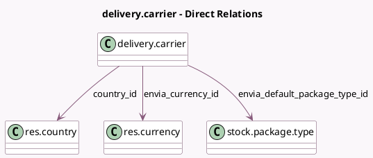

<!-- GENERATED:MODEL -->
---
tags: [odoo, enterprise, generated, model]
---

# delivery.carrier

- Module: [[docs/Enterprise Addons/delivery_envia/delivery_envia|delivery_envia]]
- Scope: Enterprise Addons
- Defined in module: extension only
- Source files: `models/delivery_carrier.py`
- Python classes: `DeliverCarrier`

## Field footprint

- Detected fields: 17
- Field types: `Boolean` x 5, `Char` x 3, `Many2one` x 3, `Selection` x 4, `Text` x 2
- Relation fields: 3

## Sample fields

- `country_id`: `Many2one` (comodel `res.country`)
- `delivery_type`: `Selection`
- `envia_carrier_code`: `Char` (compute `_compute_services`, store `True`)
- `envia_currency_id`: `Many2one` (comodel `res.currency`)
- `envia_default_package_type_id`: `Many2one` (comodel `stock.package.type`)
- `envia_label_file_type`: `Selection`
- `envia_label_stock_type`: `Selection`
- `envia_lift_delivery`: `Boolean`
- `envia_lift_pickup`: `Boolean`
- `envia_mail_type`: `Selection` (related `envia_default_package_type_id.envia_mail_type`)
- `envia_production_api_key`: `Text`
- `envia_residential_delivery`: `Boolean`
- `envia_residential_pickup`: `Boolean`
- `envia_return_at_senders_expense`: `Boolean`
- `envia_sandbox_api_key`: `Text`
- `envia_service_code`: `Char` (compute `_compute_services`, store `True`)
- `envia_service_name`: `Char` (compute `_compute_services`, store `True`)

## Method hints

- Detected methods: 9
- Action methods: `action_open_envia_wizard`
- Compute methods: `_compute_services`, `_compute_supports_shipping_insurance`
- Onchange methods: none

## Direct relation diagram

## Navigation

- **Parent:** [[docs/Enterprise Addons/delivery_envia/Models]]

<!-- GENERATED:MODEL -->
