<!-- GENERATED:MODEL -->
---
tags: [odoo, enterprise, generated, model]
---

# delivery.carrier

- Module: [[docs/Enterprise Addons/delivery_fedex/delivery_fedex|delivery_fedex]]
- Scope: Enterprise Addons
- Defined in module: extension only
- Source files: `models/delivery_fedex.py`
- Python classes: `DeliveryCarrier`

## Field footprint

- Detected fields: 17
- Field types: `Boolean` x 1, `Char` x 4, `Many2one` x 1, `Selection` x 8, `Text` x 3
- Relation fields: 1

## Sample fields

- `delivery_type`: `Selection`
- `fedex_account_number`: `Char`
- `fedex_default_package_type_id`: `Many2one` (comodel `stock.package.type`)
- `fedex_developer_key`: `Char`
- `fedex_developer_password`: `Char`
- `fedex_document_stock_type`: `Selection`
- `fedex_droppoff_type`: `Selection`
- `fedex_duty_payment`: `Selection`
- `fedex_extra_data_rate_request`: `Text` (comodel `Extra data for rate (legacy)`)
- `fedex_extra_data_return_request`: `Text` (comodel `Extra data for return (legacy)`)
- `fedex_extra_data_ship_request`: `Text` (comodel `Extra data for ship (legacy)`)
- `fedex_label_file_type`: `Selection`
- `fedex_label_stock_type`: `Selection`
- `fedex_meter_number`: `Char`
- `fedex_saturday_delivery`: `Boolean`
- `fedex_service_type`: `Selection`
- `fedex_weight_unit`: `Selection`

## Method hints

- Detected methods: 13
- Action methods: none
- Compute methods: `_compute_can_generate_return`, `_compute_supports_shipping_insurance`
- Onchange methods: `on_change_fedex_service_type`

## Direct relation diagram

```plantuml
@startuml
!define ODOO_COLOR_PRIMARY #714B67
!define ODOO_COLOR_ACCENT #875A7B
!define ODOO_COLOR_BG #FAF7FA

skinparam backgroundColor ODOO_COLOR_BG
skinparam defaultTextAlignment left
skinparam ArrowColor ODOO_COLOR_ACCENT
skinparam ClassBackgroundColor white
skinparam ClassBorderColor ODOO_COLOR_PRIMARY
skinparam ComponentBackgroundColor white
skinparam ComponentBorderColor ODOO_COLOR_PRIMARY
skinparam NoteBackgroundColor #FFF8FF
skinparam NoteBorderColor ODOO_COLOR_ACCENT
skinparam SequenceLifeLineBorderColor ODOO_COLOR_ACCENT
skinparam SequenceLifeLineBackgroundColor #FFFFFF
skinparam SequenceParticipantBorderColor ODOO_COLOR_PRIMARY
skinparam SequenceParticipantBackgroundColor #FFFFFF
skinparam sequence {
  ArrowColor ODOO_COLOR_ACCENT
  ActorBorderColor ODOO_COLOR_PRIMARY
}
title delivery.carrier - Direct Relations
class "delivery.carrier" as delivery_carrier
class "stock.package.type" as stock_package_type
delivery_carrier --> stock_package_type : fedex_default_package_type_id
@enduml
```

## Navigation

- **Parent:** [[docs/Enterprise Addons/delivery_fedex/Models]]

<!-- GENERATED:MODEL -->
