<!-- GENERATED:MODEL -->
---
tags: [odoo, enterprise, generated, model]
---

# stock.put.in.pack

- Module: [[docs/Enterprise Addons/delivery_iot/delivery_iot|delivery_iot]]
- Scope: Enterprise Addons
- Defined in module: extension only
- Source files: `wizard/stock_put_in_pack.py`
- Python classes: `StockPutInPack`

## Field footprint

- Detected fields: 5
- Field types: `Boolean` x 1, `Char` x 2, `Many2many` x 1, `Many2one` x 1
- Relation fields: 2

## Sample fields

- `available_scale_ids`: `Many2many` (comodel `iot.device`, compute `_compute_available_scale_ids`)
- `iot_device_id`: `Many2one` (comodel `iot.device`, compute `_compute_iot_device_id`, store `True`)
- `iot_device_identifier`: `Char` (related `iot_device_id.identifier`)
- `iot_ip`: `Char` (related `iot_device_id.iot_ip`)
- `manual_measurement`: `Boolean` (related `iot_device_id.manual_measurement`)

## Method hints

- Detected methods: 2
- Action methods: none
- Compute methods: `_compute_available_scale_ids`, `_compute_iot_device_id`
- Onchange methods: none

## Direct relation diagram

```plantuml
@startuml
!define ODOO_COLOR_PRIMARY #714B67
!define ODOO_COLOR_ACCENT #875A7B
!define ODOO_COLOR_BG #FAF7FA

skinparam backgroundColor ODOO_COLOR_BG
skinparam defaultTextAlignment left
skinparam ArrowColor ODOO_COLOR_ACCENT
skinparam ClassBackgroundColor white
skinparam ClassBorderColor ODOO_COLOR_PRIMARY
skinparam ComponentBackgroundColor white
skinparam ComponentBorderColor ODOO_COLOR_PRIMARY
skinparam NoteBackgroundColor #FFF8FF
skinparam NoteBorderColor ODOO_COLOR_ACCENT
skinparam SequenceLifeLineBorderColor ODOO_COLOR_ACCENT
skinparam SequenceLifeLineBackgroundColor #FFFFFF
skinparam SequenceParticipantBorderColor ODOO_COLOR_PRIMARY
skinparam SequenceParticipantBackgroundColor #FFFFFF
skinparam sequence {
  ArrowColor ODOO_COLOR_ACCENT
  ActorBorderColor ODOO_COLOR_PRIMARY
}
title stock.put.in.pack - Direct Relations
class "stock.put.in.pack" as stock_put_in_pack
class "iot.device" as iot_device
stock_put_in_pack .. iot_device : available_scale_ids
stock_put_in_pack --> iot_device : iot_device_id
@enduml
```

## Navigation

- **Parent:** [[docs/Enterprise Addons/delivery_iot/Models]]

<!-- GENERATED:MODEL -->
