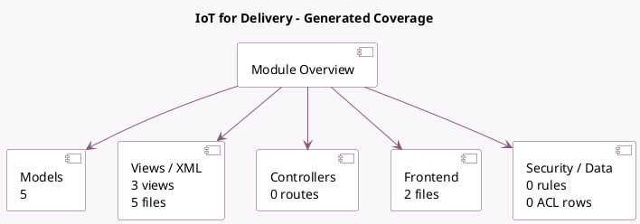

<!-- GENERATED:MODULE -->
---
tags: [odoo, enterprise, module]
---

# IoT for Delivery

- Scope: Enterprise Addons
- Source: enterprise/delivery_iot
- Dependencies: [[docs/Enterprise Addons/iot/iot|iot]], [[docs/Community Addons/stock_delivery/stock_delivery|stock_delivery]]

## Summary

Use IoT devices in delivery operations

## Generated coverage

- Models: 5
- XML files with UI/data artifacts: 5
- Views: 3
- Actions: 2
- Menus: 4
- Rules (ir.rule): 0
- Access CSV entries: 0
- Controller units: 0
- Frontend asset files: 2

## Module map

## Detail notes

- Models: [[docs/Enterprise Addons/delivery_iot/Models|Models]] (5)
- Views and XML: [[docs/Enterprise Addons/delivery_iot/Views|Views]] (5 files)
- Frontend: [[docs/Enterprise Addons/delivery_iot/Frontend|Frontend]] (2 files)

## Key models

- `iot.device`
- `ir.actions.report`
- `stock.picking`
- `stock.picking.type`
- `stock.put.in.pack`

## Navigation

- [[../Enterprise Addons/Enterprise Addons|Back to scope]]
- [[../../docs/docs|Back to docs]]

<!-- GENERATED:MODULE -->

