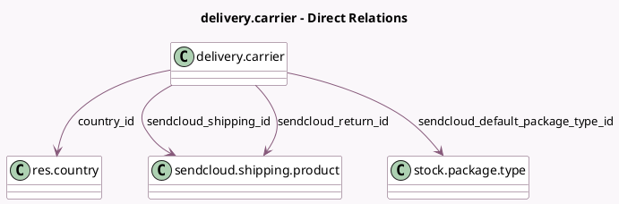

<!-- GENERATED:MODEL -->
---
tags: [odoo, enterprise, generated, model]
---

# delivery.carrier

- Module: [[docs/Enterprise Addons/delivery_sendcloud/delivery_sendcloud|delivery_sendcloud]]
- Scope: Enterprise Addons
- Defined in module: extension only
- Source files: `models/delivery_carrier.py`
- Python classes: `DeliveryCarrier`

## Field footprint

- Detected fields: 14
- Field types: `Boolean` x 4, `Char` x 4, `Json` x 1, `Many2one` x 4, `Selection` x 1
- Relation fields: 4

## Sample fields

- `country_id`: `Many2one` (comodel `res.country`, compute `_compute_country_id`, store `True`)
- `delivery_type`: `Selection`
- `sendcloud_can_batch_shipping`: `Boolean` (related `sendcloud_shipping_id.has_multicollo`)
- `sendcloud_default_package_type_id`: `Many2one` (comodel `stock.package.type`)
- `sendcloud_has_custom_functionalities`: `Boolean` (related `sendcloud_shipping_id.can_customize_functionalities`)
- `sendcloud_product_functionalities`: `Json`
- `sendcloud_public_key`: `Char`
- `sendcloud_return_id`: `Many2one` (comodel `sendcloud.shipping.product`, compute `_compute_sendcloud_return_id`, store `True`)
- `sendcloud_return_name`: `Char` (related `sendcloud_return_id.name`)
- `sendcloud_secret_key`: `Char`
- `sendcloud_shipping_id`: `Many2one` (comodel `sendcloud.shipping.product`, compute `_compute_sendcloud_shipping_id`, store `True`)
- `sendcloud_shipping_name`: `Char` (related `sendcloud_shipping_id.name`)
- `sendcloud_shipping_rules`: `Boolean`
- `sendcloud_use_batch_shipping`: `Boolean`

## Method hints

- Detected methods: 20
- Action methods: `action_load_sendcloud_shipping_products`
- Compute methods: `_compute_can_generate_return`, `_compute_country_id`, `_compute_sendcloud_return_id`, `_compute_sendcloud_shipping_id`
- Onchange methods: none

## Direct relation diagram

## Navigation

- **Parent:** [[docs/Enterprise Addons/delivery_sendcloud/Models]]

<!-- GENERATED:MODEL -->
