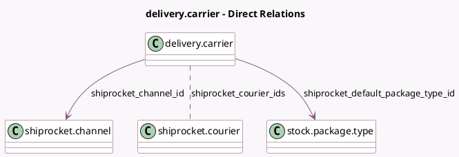

<!-- GENERATED:MODEL -->
---
tags: [odoo, enterprise, generated, model]
---

# delivery.carrier

- Module: [[docs/Enterprise Addons/delivery_shiprocket/delivery_shiprocket|delivery_shiprocket]]
- Scope: Enterprise Addons
- Defined in module: extension only
- Source files: `models/delivery_carrier.py`
- Python classes: `DeliveryCarrier`

## Field footprint

- Detected fields: 10
- Field types: `Boolean` x 2, `Char` x 2, `Datetime` x 1, `Many2many` x 1, `Many2one` x 2, `Selection` x 1, `Text` x 1
- Relation fields: 3

## Sample fields

- `delivery_type`: `Selection`
- `shiprocket_access_token`: `Text`
- `shiprocket_channel_id`: `Many2one` (comodel `shiprocket.channel`)
- `shiprocket_courier_ids`: `Many2many` (comodel `shiprocket.courier`)
- `shiprocket_default_package_type_id`: `Many2one` (comodel `stock.package.type`)
- `shiprocket_email`: `Char`
- `shiprocket_manifests_generate`: `Boolean`
- `shiprocket_password`: `Char`
- `shiprocket_pickup_request`: `Boolean`
- `shiprocket_token_valid_upto`: `Datetime`

## Method hints

- Detected methods: 9
- Action methods: `action_get_channels`, `action_get_couriers`, `action_shiprocket_test_connection`
- Compute methods: none
- Onchange methods: none

## Direct relation diagram

## Navigation

- **Parent:** [[docs/Enterprise Addons/delivery_shiprocket/Models]]

<!-- GENERATED:MODEL -->
