<!-- GENERATED:MODEL -->
---
tags: [odoo, enterprise, generated, model]
---

# delivery.carrier

- Module: [[docs/Enterprise Addons/delivery_starshipit/delivery_starshipit|delivery_starshipit]]
- Scope: Enterprise Addons
- Defined in module: extension only
- Source files: `models/delivery_carrier.py`
- Python classes: `DeliveryCarrier`

## Field footprint

- Detected fields: 8
- Field types: `Char` x 5, `Many2one` x 2, `Selection` x 1
- Relation fields: 2

## Sample fields

- `delivery_type`: `Selection`
- `starshipit_api_key`: `Char`
- `starshipit_carrier_code`: `Char`
- `starshipit_default_package_type_id`: `Many2one` (comodel `stock.package.type`)
- `starshipit_origin_address`: `Many2one` (comodel `res.partner`)
- `starshipit_service_code`: `Char`
- `starshipit_service_name`: `Char`
- `starshipit_subscription_key`: `Char`

## Method hints

- Detected methods: 12
- Action methods: none
- Compute methods: `_compute_can_generate_return`
- Onchange methods: none

## Direct relation diagram

```plantuml
@startuml
!define ODOO_COLOR_PRIMARY #714B67
!define ODOO_COLOR_ACCENT #875A7B
!define ODOO_COLOR_BG #FAF7FA

skinparam backgroundColor ODOO_COLOR_BG
skinparam defaultTextAlignment left
skinparam ArrowColor ODOO_COLOR_ACCENT
skinparam ClassBackgroundColor white
skinparam ClassBorderColor ODOO_COLOR_PRIMARY
skinparam ComponentBackgroundColor white
skinparam ComponentBorderColor ODOO_COLOR_PRIMARY
skinparam NoteBackgroundColor #FFF8FF
skinparam NoteBorderColor ODOO_COLOR_ACCENT
skinparam SequenceLifeLineBorderColor ODOO_COLOR_ACCENT
skinparam SequenceLifeLineBackgroundColor #FFFFFF
skinparam SequenceParticipantBorderColor ODOO_COLOR_PRIMARY
skinparam SequenceParticipantBackgroundColor #FFFFFF
skinparam sequence {
  ArrowColor ODOO_COLOR_ACCENT
  ActorBorderColor ODOO_COLOR_PRIMARY
}
title delivery.carrier - Direct Relations
class "delivery.carrier" as delivery_carrier
class "res.partner" as res_partner
class "stock.package.type" as stock_package_type
delivery_carrier --> stock_package_type : starshipit_default_package_type_id
delivery_carrier --> res_partner : starshipit_origin_address
@enduml
```

## Navigation

- **Parent:** [[docs/Enterprise Addons/delivery_starshipit/Models]]

<!-- GENERATED:MODEL -->
