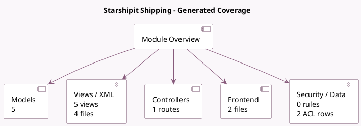

<!-- GENERATED:MODULE -->
---
tags: [odoo, enterprise, module]
---

# Starshipit Shipping

- Scope: Enterprise Addons
- Source: enterprise/delivery_starshipit
- Dependencies: [[docs/Community Addons/stock_delivery/stock_delivery|stock_delivery]]

## Generated coverage

- Models: 5
- XML files with UI/data artifacts: 4
- Views: 5
- Actions: 1
- Menus: 0
- Rules (ir.rule): 0
- Access CSV entries: 2
- Controller units: 1
- Frontend asset files: 2

## Module map

## Detail notes

- Models: [[docs/Enterprise Addons/delivery_starshipit/Models|Models]] (5)
- Views and XML: [[docs/Enterprise Addons/delivery_starshipit/Views|Views]] (4 files)
- Controllers: [[docs/Enterprise Addons/delivery_starshipit/Controllers|Controllers]] (1)
- Frontend: [[docs/Enterprise Addons/delivery_starshipit/Frontend|Frontend]] (2 files)

## Key models

- `delivery.carrier`
- `starshipit.shipping.wizard`
- `stock.package.type`
- `stock.picking`
- `stock.return.picking`

## Navigation

- [[../Enterprise Addons/Enterprise Addons|Back to scope]]
- [[../../docs/docs|Back to docs]]

<!-- GENERATED:MODULE -->

