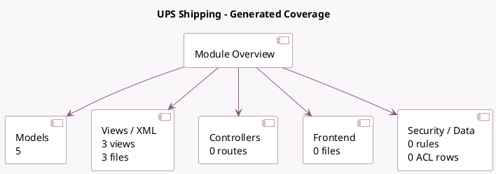

<!-- GENERATED:MODULE -->
---
tags: [odoo, enterprise, module]
---

# UPS Shipping

- Scope: Enterprise Addons
- Source: enterprise/delivery_ups_rest
- Dependencies: [[docs/Community Addons/stock_delivery/stock_delivery|stock_delivery]], [[docs/Community Addons/mail/mail|mail]]

## Summary

Send your shippings through UPS and track them online. This new version of the UPS connector is compatiblewith the newest version of the UPS REST APIs available at https://developer.ups.com/

## Generated coverage

- Models: 5
- XML files with UI/data artifacts: 3
- Views: 3
- Actions: 0
- Menus: 0
- Rules (ir.rule): 0
- Access CSV entries: 0
- Controller units: 0
- Frontend asset files: 0

## Module map

## Detail notes

- Models: [[docs/Enterprise Addons/delivery_ups_rest/Models|Models]] (5)
- Views and XML: [[docs/Enterprise Addons/delivery_ups_rest/Views|Views]] (3 files)

## Key models

- `delivery.carrier`
- `payment.provider`
- `res.partner`
- `sale.order`
- `stock.package.type`

## Navigation

- [[../Enterprise Addons/Enterprise Addons|Back to scope]]
- [[../../docs/docs|Back to docs]]

<!-- GENERATED:MODULE -->

