<!-- GENERATED:MODEL -->
---
tags: [odoo, enterprise, generated, model]
---

# delivery.carrier

- Module: [[docs/Enterprise Addons/delivery_usps/delivery_usps|delivery_usps]]
- Scope: Enterprise Addons
- Defined in module: extension only
- Source files: `models/delivery_usps.py`
- Python classes: `DeliveryCarrier`

## Field footprint

- Detected fields: 20
- Field types: `Boolean` x 2, `Char` x 1, `Float` x 4, `Many2one` x 1, `Selection` x 12
- Relation fields: 1

## Sample fields

- `delivery_type`: `Selection`
- `usps_account_validated`: `Boolean`
- `usps_container`: `Selection`
- `usps_content_type`: `Selection`
- `usps_custom_container_girth`: `Float`
- `usps_custom_container_height`: `Float`
- `usps_custom_container_length`: `Float`
- `usps_custom_container_width`: `Float`
- `usps_delivery_nature`: `Selection`
- `usps_domestic_regular_container`: `Selection`
- `usps_first_class_mail_type`: `Selection`
- `usps_international_regular_container`: `Selection`
- `usps_intl_non_delivery_option`: `Selection`
- `usps_label_file_type`: `Selection`
- `usps_machinable`: `Boolean`
- `usps_mail_type`: `Selection`
- `usps_redirect_partner_id`: `Many2one` (comodel `res.partner`)
- `usps_service`: `Selection`
- `usps_size_container`: `Selection` (compute `_compute_size_container`, store `True`)
- `usps_username`: `Char`

## Method hints

- Detected methods: 8
- Action methods: none
- Compute methods: `_compute_can_generate_return`, `_compute_size_container`
- Onchange methods: none

## Direct relation diagram

```plantuml
@startuml
!define ODOO_COLOR_PRIMARY #714B67
!define ODOO_COLOR_ACCENT #875A7B
!define ODOO_COLOR_BG #FAF7FA

skinparam backgroundColor ODOO_COLOR_BG
skinparam defaultTextAlignment left
skinparam ArrowColor ODOO_COLOR_ACCENT
skinparam ClassBackgroundColor white
skinparam ClassBorderColor ODOO_COLOR_PRIMARY
skinparam ComponentBackgroundColor white
skinparam ComponentBorderColor ODOO_COLOR_PRIMARY
skinparam NoteBackgroundColor #FFF8FF
skinparam NoteBorderColor ODOO_COLOR_ACCENT
skinparam SequenceLifeLineBorderColor ODOO_COLOR_ACCENT
skinparam SequenceLifeLineBackgroundColor #FFFFFF
skinparam SequenceParticipantBorderColor ODOO_COLOR_PRIMARY
skinparam SequenceParticipantBackgroundColor #FFFFFF
skinparam sequence {
  ArrowColor ODOO_COLOR_ACCENT
  ActorBorderColor ODOO_COLOR_PRIMARY
}
title delivery.carrier - Direct Relations
class "delivery.carrier" as delivery_carrier
class "res.partner" as res_partner
delivery_carrier --> res_partner : usps_redirect_partner_id
@enduml
```

## Navigation

- **Parent:** [[docs/Enterprise Addons/delivery_usps/Models]]

<!-- GENERATED:MODEL -->
