<!-- GENERATED:MODEL -->
---
tags: [odoo, enterprise, generated, model]
---

# delivery.carrier

- Module: [[docs/Enterprise Addons/delivery_usps_rest/delivery_usps_rest|delivery_usps_rest]]
- Scope: Enterprise Addons
- Defined in module: extension only
- Source files: `models/delivery_usps.py`
- Python classes: `ProviderUSPS`

## Field footprint

- Detected fields: 22
- Field types: `Char` x 8, `Many2one` x 1, `Selection` x 10, `Text` x 3
- Relation fields: 1

## Sample fields

- `delivery_type`: `Selection`
- `usps_access_token`: `Char`
- `usps_api_key`: `Char`
- `usps_api_secret`: `Char`
- `usps_crid`: `Char`
- `usps_default_package_type_id`: `Many2one` (comodel `stock.package.type`)
- `usps_delivery_nature`: `Selection`
- `usps_domestic_rating_indicator`: `Selection`
- `usps_domestic_service`: `Selection`
- `usps_eps_account_number`: `Char`
- `usps_extra_data_payment_token_request`: `Text` (comodel `Extra Data for Payment Token Requests`)
- `usps_extra_data_rate_request`: `Text` (comodel `Extra Data for Rate Requests`)
- `usps_extra_data_shipment_request`: `Text` (comodel `Extra Data for Shipment Requests`)
- `usps_international_rating_indicator`: `Selection`
- `usps_international_service`: `Selection`
- `usps_label_size`: `Selection`
- `usps_manifest_mid`: `Char`
- `usps_mid`: `Char`
- `usps_payment_token`: `Char`
- `usps_processing_category`: `Selection`

## Method hints

- Detected methods: 11
- Action methods: none
- Compute methods: `_compute_can_generate_return`
- Onchange methods: none

## Direct relation diagram

```plantuml
@startuml
!define ODOO_COLOR_PRIMARY #714B67
!define ODOO_COLOR_ACCENT #875A7B
!define ODOO_COLOR_BG #FAF7FA

skinparam backgroundColor ODOO_COLOR_BG
skinparam defaultTextAlignment left
skinparam ArrowColor ODOO_COLOR_ACCENT
skinparam ClassBackgroundColor white
skinparam ClassBorderColor ODOO_COLOR_PRIMARY
skinparam ComponentBackgroundColor white
skinparam ComponentBorderColor ODOO_COLOR_PRIMARY
skinparam NoteBackgroundColor #FFF8FF
skinparam NoteBorderColor ODOO_COLOR_ACCENT
skinparam SequenceLifeLineBorderColor ODOO_COLOR_ACCENT
skinparam SequenceLifeLineBackgroundColor #FFFFFF
skinparam SequenceParticipantBorderColor ODOO_COLOR_PRIMARY
skinparam SequenceParticipantBackgroundColor #FFFFFF
skinparam sequence {
  ArrowColor ODOO_COLOR_ACCENT
  ActorBorderColor ODOO_COLOR_PRIMARY
}
title delivery.carrier - Direct Relations
class "delivery.carrier" as delivery_carrier
class "stock.package.type" as stock_package_type
delivery_carrier --> stock_package_type : usps_default_package_type_id
@enduml
```

## Navigation

- **Parent:** [[docs/Enterprise Addons/delivery_usps_rest/Models]]

<!-- GENERATED:MODEL -->
