<!-- GENERATED:MODEL -->
---
tags: [odoo, enterprise, generated, model]
---

# documents.document

- Module: [[docs/Enterprise Addons/documents/documents|documents]]
- Scope: Enterprise Addons
- Defined in module: yes
- Source files: `models/documents_document.py`
- Python classes: `DocumentsDocument`
- Description: Document
- Inherits: `mail.activity.mixin`, `mail.alias.mixin.optional`, `mail.thread.cc`

## Field footprint

- Detected fields: 63
- Field types: `Binary` x 3, `Boolean` x 7, `Char` x 16, `Html` x 1, `Integer` x 5, `Many2many` x 5, `Many2one` x 12, `Many2oneReference` x 1, `One2many` x 3, `Selection` x 8, `Text` x 2
- Relation fields: 20

## Sample fields

- `access_ids`: `One2many` (comodel `documents.access`)
- `access_internal`: `Selection`
- `access_token`: `Char` (compute `_compute_access_token`)
- `access_url`: `Char` (compute `_compute_access_url`)
- `access_via_link`: `Selection`
- `active`: `Boolean`
- `alias_tag_ids`: `Many2many` (comodel `documents.tag`)
- `attachment_id`: `Many2one` (comodel `ir.attachment`)
- `attachment_name`: `Char` (comodel `Attachment Name`, related `attachment_id.name`)
- `attachment_type`: `Selection` (related `attachment_id.type`)
- `available_embedded_actions_ids`: `Many2many` (comodel `ir.embedded.actions`, compute `_compute_available_embedded_actions_ids`)
- `checksum`: `Char` (related `attachment_id.checksum`)
- `children_ids`: `One2many` (comodel `documents.document`)
- `company_id`: `Many2one` (comodel `res.company`, store `True`)
- `create_activity_date_deadline_range`: `Integer`
- `create_activity_date_deadline_range_type`: `Selection`
- `create_activity_note`: `Html`
- `create_activity_option`: `Boolean` (compute `_compute_create_activity_option`, store `True`)
- `create_activity_summary`: `Char` (comodel `Summary`)
- `create_activity_type_id`: `Many2one` (comodel `mail.activity.type`)

## Method hints

- Detected methods: 106
- Action methods: `action_archive`, `action_change_owner`, `action_create_shortcut`, `action_delete_from_history`, `action_execute_embedded_action`, `action_folder_embed_action`, `action_link_to_record`, `action_move_folder`, and 2 more
- Compute methods: `_compute_access_token`, `_compute_access_url`, `_compute_available_embedded_actions_ids`, `_compute_create_activity_option`, `_compute_deletion_delay`, `_compute_display_name`, `_compute_file_extension`, `_compute_file_size`, and 12 more
- Onchange methods: none

## Direct relation diagram

```plantuml
@startuml
!define ODOO_COLOR_PRIMARY #714B67
!define ODOO_COLOR_ACCENT #875A7B
!define ODOO_COLOR_BG #FAF7FA

skinparam backgroundColor ODOO_COLOR_BG
skinparam defaultTextAlignment left
skinparam ArrowColor ODOO_COLOR_ACCENT
skinparam ClassBackgroundColor white
skinparam ClassBorderColor ODOO_COLOR_PRIMARY
skinparam ComponentBackgroundColor white
skinparam ComponentBorderColor ODOO_COLOR_PRIMARY
skinparam NoteBackgroundColor #FFF8FF
skinparam NoteBorderColor ODOO_COLOR_ACCENT
skinparam SequenceLifeLineBorderColor ODOO_COLOR_ACCENT
skinparam SequenceLifeLineBackgroundColor #FFFFFF
skinparam SequenceParticipantBorderColor ODOO_COLOR_PRIMARY
skinparam SequenceParticipantBackgroundColor #FFFFFF
skinparam sequence {
  ArrowColor ODOO_COLOR_ACCENT
  ActorBorderColor ODOO_COLOR_PRIMARY
}
title documents.document - Direct Relations
class "documents.document" as documents_document
class "documents.access" as documents_access
class "documents.document" as documents_document
class "documents.tag" as documents_tag
class "ir.attachment" as ir_attachment
class "ir.embedded.actions" as ir_embedded_actions
class "mail.activity" as mail_activity
class "mail.activity.type" as mail_activity_type
class "res.company" as res_company
class "res.partner" as res_partner
class "res.users" as res_users
documents_document --> ir_attachment : attachment_id
documents_document .. ir_attachment : previous_attachment_ids
documents_document --> documents_document : shortcut_document_id
documents_document --> res_users : shortcut_document_owner_id
documents_document --|> documents_document : shortcut_ids
documents_document .. res_users : favorited_ids
documents_document .. documents_tag : tag_ids
documents_document --> res_partner : partner_id
documents_document --> res_users : owner_id
documents_document --> res_users : lock_uid
documents_document --> mail_activity : request_activity_id
documents_document --> res_partner : requestee_partner_id
documents_document --|> documents_access : access_ids
documents_document --> documents_document : folder_id
documents_document --|> documents_document : children_ids
documents_document --> res_company : company_id
documents_document --> mail_activity_type : create_activity_type_id
documents_document --> res_users : create_activity_user_id
@enduml
```

## Navigation

- **Parent:** [[docs/Enterprise Addons/documents/Models]]

<!-- GENERATED:MODEL -->
