<!-- GENERATED:MODEL -->
---
tags: [odoo, enterprise, generated, model]
---

# documents.link_to_record_wizard

- Module: [[docs/Enterprise Addons/documents/documents|documents]]
- Scope: Enterprise Addons
- Defined in module: yes
- Source files: `wizard/documents_link_to_record_wizard.py`
- Python classes: `DocumentsLink_To_Record_Wizard`
- Description: Documents Link to Record

## Field footprint

- Detected fields: 5
- Field types: `Boolean` x 1, `Many2many` x 2, `Many2one` x 1, `Reference` x 1
- Relation fields: 3

## Sample fields

- `accessible_model_ids`: `Many2many` (comodel `ir.model`, compute `_compute_accessible_model_ids`)
- `document_ids`: `Many2many` (comodel `documents.document`)
- `is_readonly_model`: `Boolean` (comodel `is_readonly_model`)
- `model_id`: `Many2one` (comodel `ir.model`)
- `resource_ref`: `Reference`

## Method hints

- Detected methods: 4
- Action methods: none
- Compute methods: `_compute_accessible_model_ids`
- Onchange methods: none

## Direct relation diagram

```plantuml
@startuml
!define ODOO_COLOR_PRIMARY #714B67
!define ODOO_COLOR_ACCENT #875A7B
!define ODOO_COLOR_BG #FAF7FA

skinparam backgroundColor ODOO_COLOR_BG
skinparam defaultTextAlignment left
skinparam ArrowColor ODOO_COLOR_ACCENT
skinparam ClassBackgroundColor white
skinparam ClassBorderColor ODOO_COLOR_PRIMARY
skinparam ComponentBackgroundColor white
skinparam ComponentBorderColor ODOO_COLOR_PRIMARY
skinparam NoteBackgroundColor #FFF8FF
skinparam NoteBorderColor ODOO_COLOR_ACCENT
skinparam SequenceLifeLineBorderColor ODOO_COLOR_ACCENT
skinparam SequenceLifeLineBackgroundColor #FFFFFF
skinparam SequenceParticipantBorderColor ODOO_COLOR_PRIMARY
skinparam SequenceParticipantBackgroundColor #FFFFFF
skinparam sequence {
  ArrowColor ODOO_COLOR_ACCENT
  ActorBorderColor ODOO_COLOR_PRIMARY
}
title documents.link_to_record_wizard - Direct Relations
class "documents.link_to_record_wizard" as documents_link_to_record_wizard
class "documents.document" as documents_document
class "ir.model" as ir_model
documents_link_to_record_wizard .. documents_document : document_ids
documents_link_to_record_wizard --> ir_model : model_id
documents_link_to_record_wizard .. ir_model : accessible_model_ids
@enduml
```

## Navigation

- **Parent:** [[docs/Enterprise Addons/documents/Models]]

<!-- GENERATED:MODEL -->
