<!-- GENERATED:MODEL -->
---
tags: [odoo, enterprise, generated, model]
---

# documents.operation

- Module: [[docs/Enterprise Addons/documents/documents|documents]]
- Scope: Enterprise Addons
- Defined in module: yes
- Source files: `wizard/documents_operation.py`
- Python classes: `DocumentsOperation`
- Description: Documents Operation

## Field footprint

- Detected fields: 10
- Field types: `Boolean` x 1, `Char` x 4, `Many2many` x 1, `Many2one` x 1, `One2many` x 1, `Selection` x 2
- Relation fields: 3

## Sample fields

- `access_internal`: `Char`
- `access_via_link`: `Char`
- `attachment_id`: `Many2one` (comodel `ir.attachment`)
- `destination`: `Char`
- `destination_children_ids`: `One2many` (comodel `documents.document`, compute `_compute_destination_children_ids`)
- `display_name`: `Char`
- `document_ids`: `Many2many` (comodel `documents.document`)
- `is_access_via_link_hidden`: `Boolean`
- `operation`: `Selection`
- `user_permission`: `Selection`

## Method hints

- Detected methods: 4
- Action methods: `action_confirm`
- Compute methods: `_compute_destination_children_ids`
- Onchange methods: none

## Direct relation diagram

```plantuml
@startuml
!define ODOO_COLOR_PRIMARY #714B67
!define ODOO_COLOR_ACCENT #875A7B
!define ODOO_COLOR_BG #FAF7FA

skinparam backgroundColor ODOO_COLOR_BG
skinparam defaultTextAlignment left
skinparam ArrowColor ODOO_COLOR_ACCENT
skinparam ClassBackgroundColor white
skinparam ClassBorderColor ODOO_COLOR_PRIMARY
skinparam ComponentBackgroundColor white
skinparam ComponentBorderColor ODOO_COLOR_PRIMARY
skinparam NoteBackgroundColor #FFF8FF
skinparam NoteBorderColor ODOO_COLOR_ACCENT
skinparam SequenceLifeLineBorderColor ODOO_COLOR_ACCENT
skinparam SequenceLifeLineBackgroundColor #FFFFFF
skinparam SequenceParticipantBorderColor ODOO_COLOR_PRIMARY
skinparam SequenceParticipantBackgroundColor #FFFFFF
skinparam sequence {
  ArrowColor ODOO_COLOR_ACCENT
  ActorBorderColor ODOO_COLOR_PRIMARY
}
title documents.operation - Direct Relations
class "documents.operation" as documents_operation
class "documents.document" as documents_document
class "ir.attachment" as ir_attachment
documents_operation .. documents_document : document_ids
documents_operation --> ir_attachment : attachment_id
documents_operation --|> documents_document : destination_children_ids
@enduml
```

## Navigation

- **Parent:** [[docs/Enterprise Addons/documents/Models]]

<!-- GENERATED:MODEL -->
