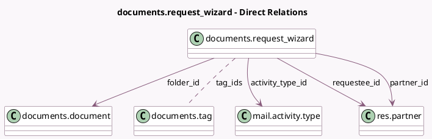

<!-- GENERATED:MODEL -->
---
tags: [odoo, enterprise, generated, model]
---

# documents.request_wizard

- Module: [[docs/Enterprise Addons/documents/documents|documents]]
- Scope: Enterprise Addons
- Defined in module: yes
- Source files: `wizard/documents_request_wizard.py`
- Python classes: `DocumentsRequest_Wizard`
- Description: Document Request

## Field footprint

- Detected fields: 11
- Field types: `Char` x 2, `Html` x 1, `Integer` x 2, `Many2many` x 1, `Many2one` x 4, `Selection` x 1
- Relation fields: 5

## Sample fields

- `activity_date_deadline_range`: `Integer`
- `activity_date_deadline_range_type`: `Selection`
- `activity_note`: `Html`
- `activity_type_id`: `Many2one` (comodel `mail.activity.type`)
- `folder_id`: `Many2one` (comodel `documents.document`)
- `name`: `Char`
- `partner_id`: `Many2one` (comodel `res.partner`)
- `requestee_id`: `Many2one` (comodel `res.partner`)
- `res_id`: `Integer` (comodel `Resource ID`)
- `res_model`: `Char` (comodel `Resource Model`)
- `tag_ids`: `Many2many` (comodel `documents.tag`)

## Method hints

- Detected methods: 2
- Action methods: none
- Compute methods: none
- Onchange methods: `_on_activity_type_change`

## Direct relation diagram

## Navigation

- **Parent:** [[docs/Enterprise Addons/documents/Models]]

<!-- GENERATED:MODEL -->
