<!-- GENERATED:MODEL -->
---
tags: [odoo, enterprise, generated, model]
---

# documents.sharing.access

- Module: [[docs/Enterprise Addons/documents/documents|documents]]
- Scope: Enterprise Addons
- Defined in module: yes
- Source files: `wizard/documents_sharing_access.py`
- Python classes: `DocumentsShareAccess`
- Description: Documents share access

## Field footprint

- Detected fields: 11
- Field types: `Boolean` x 6, `Datetime` x 2, `Many2one` x 2, `Selection` x 1
- Relation fields: 2

## Sample fields

- `documents_sharing_id`: `Many2one` (comodel `documents.sharing`)
- `expiration_date`: `Datetime` (comodel `Expiration`)
- `has_user`: `Boolean` (compute `_compute_has_user`)
- `has_warning_no_access`: `Boolean` (compute `_compute_has_warning_no_access`)
- `is_deleted`: `Boolean`
- `is_on_single_document`: `Boolean` (compute `_compute_is_on_single_document`)
- `is_readonly`: `Boolean` (related `documents_sharing_id.is_readonly`)
- `original_expiration_date`: `Datetime` (comodel `Original Expiration`)
- `partner_id`: `Many2one` (comodel `res.partner`)
- `partner_is_me`: `Boolean` (compute `_compute_partner_is_me`)
- `role`: `Selection` (comodel `_get_role_options`)

## Method hints

- Detected methods: 5
- Action methods: none
- Compute methods: `_compute_has_user`, `_compute_has_warning_no_access`, `_compute_is_on_single_document`, `_compute_partner_is_me`
- Onchange methods: none

## Direct relation diagram

```plantuml
@startuml
!define ODOO_COLOR_PRIMARY #714B67
!define ODOO_COLOR_ACCENT #875A7B
!define ODOO_COLOR_BG #FAF7FA

skinparam backgroundColor ODOO_COLOR_BG
skinparam defaultTextAlignment left
skinparam ArrowColor ODOO_COLOR_ACCENT
skinparam ClassBackgroundColor white
skinparam ClassBorderColor ODOO_COLOR_PRIMARY
skinparam ComponentBackgroundColor white
skinparam ComponentBorderColor ODOO_COLOR_PRIMARY
skinparam NoteBackgroundColor #FFF8FF
skinparam NoteBorderColor ODOO_COLOR_ACCENT
skinparam SequenceLifeLineBorderColor ODOO_COLOR_ACCENT
skinparam SequenceLifeLineBackgroundColor #FFFFFF
skinparam SequenceParticipantBorderColor ODOO_COLOR_PRIMARY
skinparam SequenceParticipantBackgroundColor #FFFFFF
skinparam sequence {
  ArrowColor ODOO_COLOR_ACCENT
  ActorBorderColor ODOO_COLOR_PRIMARY
}
title documents.sharing.access - Direct Relations
class "documents.sharing.access" as documents_sharing_access
class "documents.sharing" as documents_sharing
class "res.partner" as res_partner
documents_sharing_access --> documents_sharing : documents_sharing_id
documents_sharing_access --> res_partner : partner_id
@enduml
```

## Navigation

- **Parent:** [[docs/Enterprise Addons/documents/Models]]

<!-- GENERATED:MODEL -->
