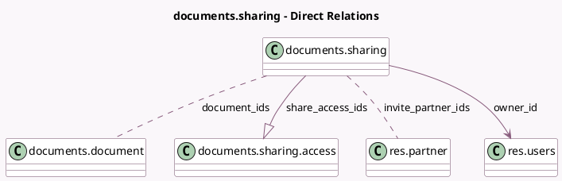

<!-- GENERATED:MODEL -->
---
tags: [odoo, enterprise, generated, model]
---

# documents.sharing

- Module: [[docs/Enterprise Addons/documents/documents|documents]]
- Scope: Enterprise Addons
- Defined in module: yes
- Source files: `wizard/documents_sharing.py`
- Python classes: `DocumentsSharing`
- Description: Documents Sharing

## Field footprint

- Detected fields: 19
- Field types: `Boolean` x 5, `Char` x 5, `Html` x 1, `Many2many` x 2, `Many2one` x 1, `One2many` x 1, `Selection` x 4
- Relation fields: 4

## Sample fields

- `access_internal`: `Selection` (comodel `_get_role_options`)
- `access_internal_help`: `Char` (compute `_compute_access_internal_help`)
- `access_urls`: `Char` (comodel `Access URLs`, compute `_compute_ui_values`)
- `access_via_link`: `Selection` (comodel `_get_role_options`)
- `access_via_link_help`: `Char` (compute `_compute_access_via_link_help`)
- `access_via_link_mode`: `Selection` (comodel `_get_access_via_link_mode`)
- `document_ids`: `Many2many` (comodel `documents.document`)
- `has_warning_link_with_more_rights`: `Char` (compute `_compute_has_warning_link_with_more_rights`)
- `has_warning_partners_without_access`: `Char` (compute `_compute_has_warning_partners_without_access`)
- `invite_notify`: `Boolean` (comodel `Notify`)
- `invite_notify_message`: `Html` (comodel `Notification Message`)
- `invite_partner_ids`: `Many2many` (comodel `res.partner`)
- `invite_role`: `Selection`
- `is_access_modified`: `Boolean` (comodel `Modified`, compute `_compute_is_access_modified`)
- `is_folder_only`: `Boolean` (comodel `Folder Only`, compute `_compute_ui_values`)
- `is_readonly`: `Boolean` (comodel `Readonly`, compute `_compute_ui_values`)
- `is_single`: `Boolean` (comodel `Single`, compute `_compute_ui_values`)
- `owner_id`: `Many2one` (comodel `res.users`, compute `_compute_ui_values`)
- `share_access_ids`: `One2many` (comodel `documents.sharing.access`)

## Method hints

- Detected methods: 15
- Action methods: `action_allow_link_access`, `action_invite_members`, `action_open`, `action_update_rights`
- Compute methods: `_compute_access_internal_help`, `_compute_access_via_link_help`, `_compute_has_warning_link_with_more_rights`, `_compute_has_warning_partners_without_access`, `_compute_is_access_modified`, `_compute_ui_values`
- Onchange methods: none

## Direct relation diagram

## Navigation

- **Parent:** [[docs/Enterprise Addons/documents/Models]]

<!-- GENERATED:MODEL -->
