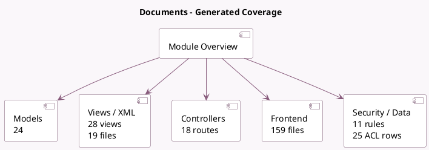

<!-- GENERATED:MODULE -->
---
tags: [odoo, enterprise, module]
---

# Documents

- Scope: Enterprise Addons
- Source: enterprise/documents
- Dependencies: base (not documented), [[docs/Community Addons/mail/mail|mail]], [[docs/Community Addons/portal/portal|portal]], [[docs/Enterprise Addons/web_enterprise/web_enterprise|web_enterprise]], [[docs/Community Addons/attachment_indexation/attachment_indexation|attachment_indexation]], [[docs/Community Addons/digest/digest|digest]]

## Summary

Collect, organize and share documents.

## Generated coverage

- Models: 24
- XML files with UI/data artifacts: 19
- Views: 28
- Actions: 13
- Menus: 9
- Rules (ir.rule): 11
- Access CSV entries: 25
- Controller units: 3
- Frontend asset files: 159

## Module map

## Detail notes

- Models: [[docs/Enterprise Addons/documents/Models|Models]] (24)
- Views and XML: [[docs/Enterprise Addons/documents/Views|Views]] (19 files)
- Controllers: [[docs/Enterprise Addons/documents/Controllers|Controllers]] (3)
- Frontend: [[docs/Enterprise Addons/documents/Frontend|Frontend]] (159 files)

## Key models

- `documents.access`
- `documents.access.tracking`
- `documents.document`
- `documents.link_to_record_wizard`
- `documents.mixin`
- `documents.operation`
- `documents.redirect`
- `documents.request_wizard`
- `documents.sharing`
- `documents.sharing.access`
- `documents.tag`
- `documents.unlink.mixin`

## Navigation

- [[../Enterprise Addons/Enterprise Addons|Back to scope]]
- [[../../docs/docs|Back to docs]]

<!-- GENERATED:MODULE -->

## Curated analysis

### Functional role
- `documents` turns `ir.attachment` into an enterprise document workspace with folders, tags, requests, sharing links, and access tracking.
- It is as much a governance layer as a UI module because it redefines how attachments are organized, exposed, and audited.

### Operational footprint
- `documents_document.py`, `documents_access.py`, and `ir_attachment.py` are the core files for document records, sharing rules, and attachment behavior.
- Controllers and wizards cover portal access, document requests, bulk operations, and sharing flows, while cron and data files preload tags, aliases, and request behavior.

### Evidence
- Source files: `enterprise/documents/models/documents_document.py`, `enterprise/documents/models/documents_access.py`, `enterprise/documents/models/ir_attachment.py`
- UI and flows: `enterprise/documents/views/documents_document_views.xml`, `enterprise/documents/views/documents_access_views.xml`, `enterprise/documents/wizard/documents_sharing.py`
- Tests: `enterprise/documents/tests/test_documents_access.py`, `enterprise/documents/tests/test_attachment_access.py`, `enterprise/documents/tests/test_attachment_split.py`

### Related notes
- `[[docs/Core/Infrastructure/Files]]`
- `[[docs/Enterprise Addons/knowledge/knowledge|knowledge]]`

### Rollout and migration concerns
- Document permissions must be reviewed before importing historical attachments because access propagation and portal exposure are built into the model, not layered on later.
- PDF split and merge operations change attachment ownership and traceability, so retention and audit expectations should be validated during rollout.
- Legacy comparison backlog was retired on 2026-03-02; keep this note focused on the current codebase.

