<!-- GENERATED:MODEL -->
---
tags: [odoo, enterprise, generated, model]
---

# account.move

- Module: [[docs/Enterprise Addons/documents_account/documents_account|documents_account]]
- Scope: Enterprise Addons
- Defined in module: yes
- Source files: `models/account_move.py`
- Python classes: `AccountMove`
- Inherits: `documents.unlink.mixin`

## Field footprint

- Detected fields: 2
- Field types: `Boolean` x 1, `Many2one` x 1
- Relation fields: 1

## Sample fields

- `has_documents`: `Boolean` (compute `_compute_has_documents`)
- `suspense_statement_line_id`: `Many2one` (comodel `account.bank.statement.line`)

## Method hints

- Detected methods: 6
- Action methods: `action_view_documents_account_move`
- Compute methods: `_compute_has_documents`
- Onchange methods: none

## Direct relation diagram

```plantuml
@startuml
!define ODOO_COLOR_PRIMARY #714B67
!define ODOO_COLOR_ACCENT #875A7B
!define ODOO_COLOR_BG #FAF7FA

skinparam backgroundColor ODOO_COLOR_BG
skinparam defaultTextAlignment left
skinparam ArrowColor ODOO_COLOR_ACCENT
skinparam ClassBackgroundColor white
skinparam ClassBorderColor ODOO_COLOR_PRIMARY
skinparam ComponentBackgroundColor white
skinparam ComponentBorderColor ODOO_COLOR_PRIMARY
skinparam NoteBackgroundColor #FFF8FF
skinparam NoteBorderColor ODOO_COLOR_ACCENT
skinparam SequenceLifeLineBorderColor ODOO_COLOR_ACCENT
skinparam SequenceLifeLineBackgroundColor #FFFFFF
skinparam SequenceParticipantBorderColor ODOO_COLOR_PRIMARY
skinparam SequenceParticipantBackgroundColor #FFFFFF
skinparam sequence {
  ArrowColor ODOO_COLOR_ACCENT
  ActorBorderColor ODOO_COLOR_PRIMARY
}
title account.move - Direct Relations
class "account.move" as account_move
class "account.bank.statement.line" as account_bank_statement_line
account_move --> account_bank_statement_line : suspense_statement_line_id
@enduml
```

## Navigation

- **Parent:** [[docs/Enterprise Addons/documents_account/Models]]

<!-- GENERATED:MODEL -->
