<!-- GENERATED:MODEL -->
---
tags: [odoo, enterprise, generated, model]
---

# account_reports.export.wizard

- Module: [[docs/Enterprise Addons/documents_account/documents_account|documents_account]]
- Scope: Enterprise Addons
- Defined in module: extension only
- Source files: `wizard/account_reports_export_wizard.py`
- Python classes: `Account_ReportsExportWizard`

## Field footprint

- Detected fields: 2
- Field types: `Many2many` x 1, `Many2one` x 1
- Relation fields: 2

## Sample fields

- `folder_id`: `Many2one` (comodel `documents.document`)
- `tag_ids`: `Many2many` (comodel `documents.tag`)

## Method hints

- Detected methods: 3
- Action methods: none
- Compute methods: none
- Onchange methods: `on_folder_id_change`

## Direct relation diagram

```plantuml
@startuml
!define ODOO_COLOR_PRIMARY #714B67
!define ODOO_COLOR_ACCENT #875A7B
!define ODOO_COLOR_BG #FAF7FA

skinparam backgroundColor ODOO_COLOR_BG
skinparam defaultTextAlignment left
skinparam ArrowColor ODOO_COLOR_ACCENT
skinparam ClassBackgroundColor white
skinparam ClassBorderColor ODOO_COLOR_PRIMARY
skinparam ComponentBackgroundColor white
skinparam ComponentBorderColor ODOO_COLOR_PRIMARY
skinparam NoteBackgroundColor #FFF8FF
skinparam NoteBorderColor ODOO_COLOR_ACCENT
skinparam SequenceLifeLineBorderColor ODOO_COLOR_ACCENT
skinparam SequenceLifeLineBackgroundColor #FFFFFF
skinparam SequenceParticipantBorderColor ODOO_COLOR_PRIMARY
skinparam SequenceParticipantBackgroundColor #FFFFFF
skinparam sequence {
  ArrowColor ODOO_COLOR_ACCENT
  ActorBorderColor ODOO_COLOR_PRIMARY
}
title account_reports.export.wizard - Direct Relations
class "account_reports.export.wizard" as account_reports_export_wizard
class "documents.document" as documents_document
class "documents.tag" as documents_tag
account_reports_export_wizard --> documents_document : folder_id
account_reports_export_wizard .. documents_tag : tag_ids
@enduml
```

## Navigation

- **Parent:** [[docs/Enterprise Addons/documents_account/Models]]

<!-- GENERATED:MODEL -->
