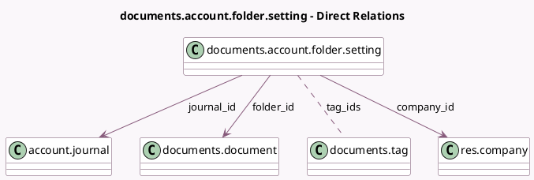

<!-- GENERATED:MODEL -->
---
tags: [odoo, enterprise, generated, model]
---

# documents.account.folder.setting

- Module: [[docs/Enterprise Addons/documents_account/documents_account|documents_account]]
- Scope: Enterprise Addons
- Defined in module: yes
- Source files: `models/documents_account_folder_setting.py`
- Python classes: `DocumentsAccountFolderSetting`
- Description: Journal and Folder settings

## Field footprint

- Detected fields: 5
- Field types: `Many2many` x 1, `Many2one` x 4
- Relation fields: 5

## Sample fields

- `company_account_folder_id`: `Many2one` (related `company_id.account_folder_id`)
- `company_id`: `Many2one` (comodel `res.company`)
- `folder_id`: `Many2one` (comodel `documents.document`)
- `journal_id`: `Many2one` (comodel `account.journal`)
- `tag_ids`: `Many2many` (comodel `documents.tag`)

## Method hints

- Detected methods: 0
- Action methods: none
- Compute methods: none
- Onchange methods: none

## Direct relation diagram

## Navigation

- **Parent:** [[docs/Enterprise Addons/documents_account/Models]]

<!-- GENERATED:MODEL -->
