<!-- GENERATED:MODEL -->
---
tags: [odoo, enterprise, generated, model]
---

# ir.actions.server

- Module: [[docs/Enterprise Addons/documents_account/documents_account|documents_account]]
- Scope: Enterprise Addons
- Defined in module: extension only
- Source files: `models/ir_actions_server.py`
- Python classes: `IrActionsServer`

## Field footprint

- Detected fields: 5
- Field types: `Char` x 1, `Many2many` x 1, `Many2one` x 1, `Selection` x 2
- Relation fields: 2

## Sample fields

- `documents_account_create_model`: `Selection`
- `documents_account_journal_id`: `Many2one` (comodel `account.journal`, compute `_compute_documents_account_journal_id`, store `True`)
- `documents_account_move_type`: `Char` (compute `_compute_documents_account_move_type`)
- `documents_account_suitable_journal_ids`: `Many2many` (comodel `account.journal`, compute `_compute_documents_account_suitable_journal_ids`)
- `state`: `Selection`

## Method hints

- Detected methods: 8
- Action methods: none
- Compute methods: `_compute_allowed_states`, `_compute_documents_account_journal_id`, `_compute_documents_account_move_type`, `_compute_documents_account_suitable_journal_ids`
- Onchange methods: none

## Direct relation diagram

```plantuml
@startuml
!define ODOO_COLOR_PRIMARY #714B67
!define ODOO_COLOR_ACCENT #875A7B
!define ODOO_COLOR_BG #FAF7FA

skinparam backgroundColor ODOO_COLOR_BG
skinparam defaultTextAlignment left
skinparam ArrowColor ODOO_COLOR_ACCENT
skinparam ClassBackgroundColor white
skinparam ClassBorderColor ODOO_COLOR_PRIMARY
skinparam ComponentBackgroundColor white
skinparam ComponentBorderColor ODOO_COLOR_PRIMARY
skinparam NoteBackgroundColor #FFF8FF
skinparam NoteBorderColor ODOO_COLOR_ACCENT
skinparam SequenceLifeLineBorderColor ODOO_COLOR_ACCENT
skinparam SequenceLifeLineBackgroundColor #FFFFFF
skinparam SequenceParticipantBorderColor ODOO_COLOR_PRIMARY
skinparam SequenceParticipantBackgroundColor #FFFFFF
skinparam sequence {
  ArrowColor ODOO_COLOR_ACCENT
  ActorBorderColor ODOO_COLOR_PRIMARY
}
title ir.actions.server - Direct Relations
class "ir.actions.server" as ir_actions_server
class "account.journal" as account_journal
ir_actions_server --> account_journal : documents_account_journal_id
ir_actions_server .. account_journal : documents_account_suitable_journal_ids
@enduml
```

## Navigation

- **Parent:** [[docs/Enterprise Addons/documents_account/Models]]

<!-- GENERATED:MODEL -->
