<!-- GENERATED:MODEL -->
---
tags: [odoo, enterprise, generated, model]
---

# res.company

- Module: [[docs/Enterprise Addons/documents_fleet/documents_fleet|documents_fleet]]
- Scope: Enterprise Addons
- Defined in module: extension only
- Source files: `models/res_company.py`
- Python classes: `ResCompany`

## Field footprint

- Detected fields: 3
- Field types: `Boolean` x 1, `Many2many` x 1, `Many2one` x 1
- Relation fields: 2

## Sample fields

- `documents_fleet_folder`: `Many2one` (comodel `documents.document`, compute `_compute_documents_fleet_folder`, store `True`)
- `documents_fleet_settings`: `Boolean`
- `documents_fleet_tags`: `Many2many` (comodel `documents.tag`)

## Method hints

- Detected methods: 2
- Action methods: none
- Compute methods: `_compute_documents_fleet_folder`
- Onchange methods: none

## Direct relation diagram

```plantuml
@startuml
!define ODOO_COLOR_PRIMARY #714B67
!define ODOO_COLOR_ACCENT #875A7B
!define ODOO_COLOR_BG #FAF7FA

skinparam backgroundColor ODOO_COLOR_BG
skinparam defaultTextAlignment left
skinparam ArrowColor ODOO_COLOR_ACCENT
skinparam ClassBackgroundColor white
skinparam ClassBorderColor ODOO_COLOR_PRIMARY
skinparam ComponentBackgroundColor white
skinparam ComponentBorderColor ODOO_COLOR_PRIMARY
skinparam NoteBackgroundColor #FFF8FF
skinparam NoteBorderColor ODOO_COLOR_ACCENT
skinparam SequenceLifeLineBorderColor ODOO_COLOR_ACCENT
skinparam SequenceLifeLineBackgroundColor #FFFFFF
skinparam SequenceParticipantBorderColor ODOO_COLOR_PRIMARY
skinparam SequenceParticipantBackgroundColor #FFFFFF
skinparam sequence {
  ArrowColor ODOO_COLOR_ACCENT
  ActorBorderColor ODOO_COLOR_PRIMARY
}
title res.company - Direct Relations
class "res.company" as res_company
class "documents.document" as documents_document
class "documents.tag" as documents_tag
res_company --> documents_document : documents_fleet_folder
res_company .. documents_tag : documents_fleet_tags
@enduml
```

## Navigation

- **Parent:** [[docs/Enterprise Addons/documents_fleet/Models]]

<!-- GENERATED:MODEL -->
