<!-- GENERATED:MODEL -->
---
tags: [odoo, enterprise, generated, model]
---

# hr.employee

- Module: [[docs/Enterprise Addons/documents_hr/documents_hr|documents_hr]]
- Scope: Enterprise Addons
- Defined in module: yes
- Source files: `models/hr_employee.py`
- Python classes: `HrEmployee`
- Inherits: `documents.mixin`

## Field footprint

- Detected fields: 3
- Field types: `Integer` x 1, `Many2one` x 2
- Relation fields: 2

## Sample fields

- `document_count`: `Integer` (compute `_compute_document_count`)
- `hr_employee_contract_folder_id`: `Many2one` (comodel `documents.document`)
- `hr_employee_folder_id`: `Many2one` (comodel `documents.document`)

## Method hints

- Detected methods: 11
- Action methods: `action_open_documents`
- Compute methods: `_compute_document_count`
- Onchange methods: none

## Direct relation diagram

```plantuml
@startuml
!define ODOO_COLOR_PRIMARY #714B67
!define ODOO_COLOR_ACCENT #875A7B
!define ODOO_COLOR_BG #FAF7FA

skinparam backgroundColor ODOO_COLOR_BG
skinparam defaultTextAlignment left
skinparam ArrowColor ODOO_COLOR_ACCENT
skinparam ClassBackgroundColor white
skinparam ClassBorderColor ODOO_COLOR_PRIMARY
skinparam ComponentBackgroundColor white
skinparam ComponentBorderColor ODOO_COLOR_PRIMARY
skinparam NoteBackgroundColor #FFF8FF
skinparam NoteBorderColor ODOO_COLOR_ACCENT
skinparam SequenceLifeLineBorderColor ODOO_COLOR_ACCENT
skinparam SequenceLifeLineBackgroundColor #FFFFFF
skinparam SequenceParticipantBorderColor ODOO_COLOR_PRIMARY
skinparam SequenceParticipantBackgroundColor #FFFFFF
skinparam sequence {
  ArrowColor ODOO_COLOR_ACCENT
  ActorBorderColor ODOO_COLOR_PRIMARY
}
title hr.employee - Direct Relations
class "hr.employee" as hr_employee
class "documents.document" as documents_document
hr_employee --> documents_document : hr_employee_folder_id
hr_employee --> documents_document : hr_employee_contract_folder_id
@enduml
```

## Navigation

- **Parent:** [[docs/Enterprise Addons/documents_hr/Models]]

<!-- GENERATED:MODEL -->
