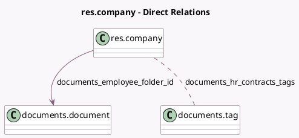

<!-- GENERATED:MODEL -->
---
tags: [odoo, enterprise, generated, model]
---

# res.company

- Module: [[docs/Enterprise Addons/documents_hr/documents_hr|documents_hr]]
- Scope: Enterprise Addons
- Defined in module: extension only
- Source files: `models/res_company.py`
- Python classes: `ResCompany`

## Field footprint

- Detected fields: 4
- Field types: `Boolean` x 1, `Char` x 1, `Many2many` x 1, `Many2one` x 1
- Relation fields: 2

## Sample fields

- `documents_employee_folder_id`: `Many2one` (comodel `documents.document`)
- `documents_hr_contracts_tags`: `Many2many` (comodel `documents.tag`)
- `documents_hr_settings`: `Boolean`
- `employee_subfolders`: `Char` (comodel `Employees Subfolder`)

## Method hints

- Detected methods: 4
- Action methods: none
- Compute methods: none
- Onchange methods: none

## Direct relation diagram

## Navigation

- **Parent:** [[docs/Enterprise Addons/documents_hr/Models]]

<!-- GENERATED:MODEL -->
