<!-- GENERATED:MODEL -->
---
tags: [odoo, enterprise, generated, model]
---

# hr.payroll.employee.declaration

- Module: [[docs/Enterprise Addons/documents_hr_payroll/documents_hr_payroll|documents_hr_payroll]]
- Scope: Enterprise Addons
- Defined in module: extension only
- Source files: `models/hr_payroll_employee_declaration.py`
- Python classes: `HrPayrollEmployeeDeclaration`

## Field footprint

- Detected fields: 3
- Field types: `Boolean` x 1, `Many2one` x 1, `Selection` x 1
- Relation fields: 1

## Sample fields

- `document_id`: `Many2one` (comodel `documents.document`)
- `pdf_to_post`: `Boolean`
- `state`: `Selection`

## Method hints

- Detected methods: 6
- Action methods: `action_post_in_documents`
- Compute methods: `_compute_state`
- Onchange methods: none

## Direct relation diagram

```plantuml
@startuml
!define ODOO_COLOR_PRIMARY #714B67
!define ODOO_COLOR_ACCENT #875A7B
!define ODOO_COLOR_BG #FAF7FA

skinparam backgroundColor ODOO_COLOR_BG
skinparam defaultTextAlignment left
skinparam ArrowColor ODOO_COLOR_ACCENT
skinparam ClassBackgroundColor white
skinparam ClassBorderColor ODOO_COLOR_PRIMARY
skinparam ComponentBackgroundColor white
skinparam ComponentBorderColor ODOO_COLOR_PRIMARY
skinparam NoteBackgroundColor #FFF8FF
skinparam NoteBorderColor ODOO_COLOR_ACCENT
skinparam SequenceLifeLineBorderColor ODOO_COLOR_ACCENT
skinparam SequenceLifeLineBackgroundColor #FFFFFF
skinparam SequenceParticipantBorderColor ODOO_COLOR_PRIMARY
skinparam SequenceParticipantBackgroundColor #FFFFFF
skinparam sequence {
  ArrowColor ODOO_COLOR_ACCENT
  ActorBorderColor ODOO_COLOR_PRIMARY
}
title hr.payroll.employee.declaration - Direct Relations
class "hr.payroll.employee.declaration" as hr_payroll_employee_declaration
class "documents.document" as documents_document
hr_payroll_employee_declaration --> documents_document : document_id
@enduml
```

## Navigation

- **Parent:** [[docs/Enterprise Addons/documents_hr_payroll/Models]]

<!-- GENERATED:MODEL -->
