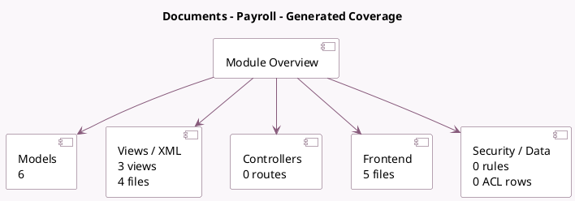

<!-- GENERATED:MODULE -->
---
tags: [odoo, enterprise, module]
---

# Documents - Payroll

- Scope: Enterprise Addons
- Source: enterprise/documents_hr_payroll
- Dependencies: [[docs/Enterprise Addons/documents_hr/documents_hr|documents_hr]], [[docs/Enterprise Addons/hr_payroll/hr_payroll|hr_payroll]]

## Summary

Store employee payslips in the Document app

## Generated coverage

- Models: 6
- XML files with UI/data artifacts: 4
- Views: 3
- Actions: 2
- Menus: 0
- Rules (ir.rule): 0
- Access CSV entries: 0
- Controller units: 0
- Frontend asset files: 5

## Module map

## Detail notes

- Models: [[docs/Enterprise Addons/documents_hr_payroll/Models|Models]] (6)
- Views and XML: [[docs/Enterprise Addons/documents_hr_payroll/Views|Views]] (4 files)
- Frontend: [[docs/Enterprise Addons/documents_hr_payroll/Frontend|Frontend]] (5 files)

## Key models

- `hr.employee`
- `hr.payroll.declaration.mixin`
- `hr.payroll.employee.declaration`
- `hr.payslip`
- `res.company`
- `res.config.settings`

## Navigation

- [[../Enterprise Addons/Enterprise Addons|Back to scope]]
- [[../../docs/docs|Back to docs]]

<!-- GENERATED:MODULE -->

