<!-- GENERATED:MODEL -->
---
tags: [odoo, enterprise, generated, model]
---

# project.project

- Module: [[docs/Enterprise Addons/documents_project/documents_project|documents_project]]
- Scope: Enterprise Addons
- Defined in module: yes
- Source files: `models/project_project.py`
- Python classes: `ProjectProject`

## Field footprint

- Detected fields: 3
- Field types: `Integer` x 1, `Many2one` x 1, `One2many` x 1
- Relation fields: 2

## Sample fields

- `document_count`: `Integer` (compute `_compute_documents`)
- `document_ids`: `One2many` (comodel `documents.document`, compute `_compute_documents`)
- `documents_folder_id`: `Many2one` (comodel `documents.document`)

## Method hints

- Detected methods: 9
- Action methods: `action_view_documents_project`
- Compute methods: `_compute_documents`
- Onchange methods: none

## Direct relation diagram

```plantuml
@startuml
!define ODOO_COLOR_PRIMARY #714B67
!define ODOO_COLOR_ACCENT #875A7B
!define ODOO_COLOR_BG #FAF7FA

skinparam backgroundColor ODOO_COLOR_BG
skinparam defaultTextAlignment left
skinparam ArrowColor ODOO_COLOR_ACCENT
skinparam ClassBackgroundColor white
skinparam ClassBorderColor ODOO_COLOR_PRIMARY
skinparam ComponentBackgroundColor white
skinparam ComponentBorderColor ODOO_COLOR_PRIMARY
skinparam NoteBackgroundColor #FFF8FF
skinparam NoteBorderColor ODOO_COLOR_ACCENT
skinparam SequenceLifeLineBorderColor ODOO_COLOR_ACCENT
skinparam SequenceLifeLineBackgroundColor #FFFFFF
skinparam SequenceParticipantBorderColor ODOO_COLOR_PRIMARY
skinparam SequenceParticipantBackgroundColor #FFFFFF
skinparam sequence {
  ArrowColor ODOO_COLOR_ACCENT
  ActorBorderColor ODOO_COLOR_PRIMARY
}
title project.project - Direct Relations
class "project.project" as project_project
class "documents.document" as documents_document
project_project --> documents_document : documents_folder_id
project_project --|> documents_document : document_ids
@enduml
```

## Navigation

- **Parent:** [[docs/Enterprise Addons/documents_project/Models]]

<!-- GENERATED:MODEL -->
