<!-- GENERATED:MODEL -->
---
tags: [odoo, enterprise, generated, model]
---

# sign.template

- Module: [[docs/Enterprise Addons/documents_sign/documents_sign|documents_sign]]
- Scope: Enterprise Addons
- Defined in module: yes
- Source files: `models/sign_template.py`
- Python classes: `SignTemplate`
- Inherits: `documents.unlink.mixin`

## Field footprint

- Detected fields: 2
- Field types: `Many2many` x 1, `Many2one` x 1
- Relation fields: 2

## Sample fields

- `documents_tag_ids`: `Many2many` (comodel `documents.tag`)
- `folder_id`: `Many2one` (comodel `documents.document`)

## Method hints

- Detected methods: 1
- Action methods: none
- Compute methods: none
- Onchange methods: none

## Direct relation diagram

```plantuml
@startuml
!define ODOO_COLOR_PRIMARY #714B67
!define ODOO_COLOR_ACCENT #875A7B
!define ODOO_COLOR_BG #FAF7FA

skinparam backgroundColor ODOO_COLOR_BG
skinparam defaultTextAlignment left
skinparam ArrowColor ODOO_COLOR_ACCENT
skinparam ClassBackgroundColor white
skinparam ClassBorderColor ODOO_COLOR_PRIMARY
skinparam ComponentBackgroundColor white
skinparam ComponentBorderColor ODOO_COLOR_PRIMARY
skinparam NoteBackgroundColor #FFF8FF
skinparam NoteBorderColor ODOO_COLOR_ACCENT
skinparam SequenceLifeLineBorderColor ODOO_COLOR_ACCENT
skinparam SequenceLifeLineBackgroundColor #FFFFFF
skinparam SequenceParticipantBorderColor ODOO_COLOR_PRIMARY
skinparam SequenceParticipantBackgroundColor #FFFFFF
skinparam sequence {
  ArrowColor ODOO_COLOR_ACCENT
  ActorBorderColor ODOO_COLOR_PRIMARY
}
title sign.template - Direct Relations
class "sign.template" as sign_template
class "documents.document" as documents_document
class "documents.tag" as documents_tag
sign_template --> documents_document : folder_id
sign_template .. documents_tag : documents_tag_ids
@enduml
```

## Navigation

- **Parent:** [[docs/Enterprise Addons/documents_sign/Models]]

<!-- GENERATED:MODEL -->
