<!-- GENERATED:MODEL -->
---
tags: [odoo, enterprise, generated, model]
---

# spreadsheet.cell.thread

- Module: [[docs/Enterprise Addons/documents_spreadsheet/documents_spreadsheet|documents_spreadsheet]]
- Scope: Enterprise Addons
- Defined in module: extension only
- Source files: `models/spreadsheet_cell_thread.py`
- Python classes: `SpreadsheetCellThread`

## Field footprint

- Detected fields: 2
- Field types: `Many2one` x 2
- Relation fields: 2

## Sample fields

- `document_id`: `Many2one` (comodel `documents.document`)
- `template_id`: `Many2one` (comodel `spreadsheet.template`)

## Method hints

- Detected methods: 1
- Action methods: none
- Compute methods: none
- Onchange methods: none

## Direct relation diagram

```plantuml
@startuml
!define ODOO_COLOR_PRIMARY #714B67
!define ODOO_COLOR_ACCENT #875A7B
!define ODOO_COLOR_BG #FAF7FA

skinparam backgroundColor ODOO_COLOR_BG
skinparam defaultTextAlignment left
skinparam ArrowColor ODOO_COLOR_ACCENT
skinparam ClassBackgroundColor white
skinparam ClassBorderColor ODOO_COLOR_PRIMARY
skinparam ComponentBackgroundColor white
skinparam ComponentBorderColor ODOO_COLOR_PRIMARY
skinparam NoteBackgroundColor #FFF8FF
skinparam NoteBorderColor ODOO_COLOR_ACCENT
skinparam SequenceLifeLineBorderColor ODOO_COLOR_ACCENT
skinparam SequenceLifeLineBackgroundColor #FFFFFF
skinparam SequenceParticipantBorderColor ODOO_COLOR_PRIMARY
skinparam SequenceParticipantBackgroundColor #FFFFFF
skinparam sequence {
  ArrowColor ODOO_COLOR_ACCENT
  ActorBorderColor ODOO_COLOR_PRIMARY
}
title spreadsheet.cell.thread - Direct Relations
class "spreadsheet.cell.thread" as spreadsheet_cell_thread
class "documents.document" as documents_document
class "spreadsheet.template" as spreadsheet_template
spreadsheet_cell_thread --> documents_document : document_id
spreadsheet_cell_thread --> spreadsheet_template : template_id
@enduml
```

## Navigation

- **Parent:** [[docs/Enterprise Addons/documents_spreadsheet/Models]]

<!-- GENERATED:MODEL -->
