<!-- GENERATED:MODEL -->
---
tags: [odoo, enterprise, generated, model]
---

# spreadsheet.contributor

- Module: [[docs/Enterprise Addons/documents_spreadsheet/documents_spreadsheet|documents_spreadsheet]]
- Scope: Enterprise Addons
- Defined in module: yes
- Source files: `models/spreadsheet_contributor.py`
- Python classes: `SpreadsheetContributor`
- Description: Spreadsheet Contributor

## Field footprint

- Detected fields: 3
- Field types: `Datetime` x 1, `Many2one` x 2
- Relation fields: 2

## Sample fields

- `document_id`: `Many2one` (comodel `documents.document`)
- `last_update_date`: `Datetime` (comodel `Last update date`)
- `user_id`: `Many2one` (comodel `res.users`)

## Method hints

- Detected methods: 1
- Action methods: none
- Compute methods: none
- Onchange methods: none

## Direct relation diagram

```plantuml
@startuml
!define ODOO_COLOR_PRIMARY #714B67
!define ODOO_COLOR_ACCENT #875A7B
!define ODOO_COLOR_BG #FAF7FA

skinparam backgroundColor ODOO_COLOR_BG
skinparam defaultTextAlignment left
skinparam ArrowColor ODOO_COLOR_ACCENT
skinparam ClassBackgroundColor white
skinparam ClassBorderColor ODOO_COLOR_PRIMARY
skinparam ComponentBackgroundColor white
skinparam ComponentBorderColor ODOO_COLOR_PRIMARY
skinparam NoteBackgroundColor #FFF8FF
skinparam NoteBorderColor ODOO_COLOR_ACCENT
skinparam SequenceLifeLineBorderColor ODOO_COLOR_ACCENT
skinparam SequenceLifeLineBackgroundColor #FFFFFF
skinparam SequenceParticipantBorderColor ODOO_COLOR_PRIMARY
skinparam SequenceParticipantBackgroundColor #FFFFFF
skinparam sequence {
  ArrowColor ODOO_COLOR_ACCENT
  ActorBorderColor ODOO_COLOR_PRIMARY
}
title spreadsheet.contributor - Direct Relations
class "spreadsheet.contributor" as spreadsheet_contributor
class "documents.document" as documents_document
class "res.users" as res_users
spreadsheet_contributor --> documents_document : document_id
spreadsheet_contributor --> res_users : user_id
@enduml
```

## Navigation

- **Parent:** [[docs/Enterprise Addons/documents_spreadsheet/Models]]

<!-- GENERATED:MODEL -->
